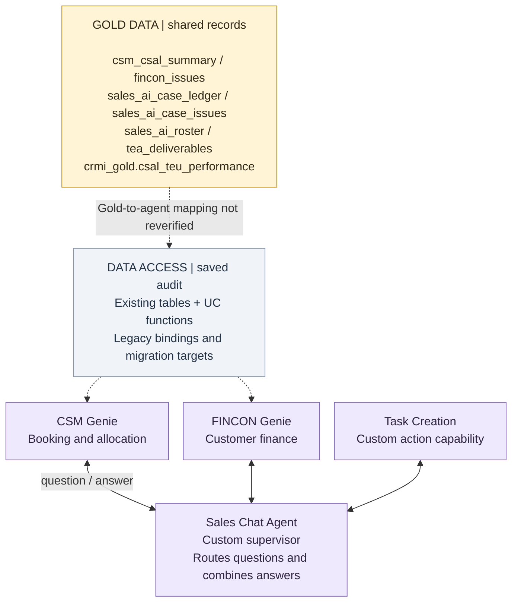
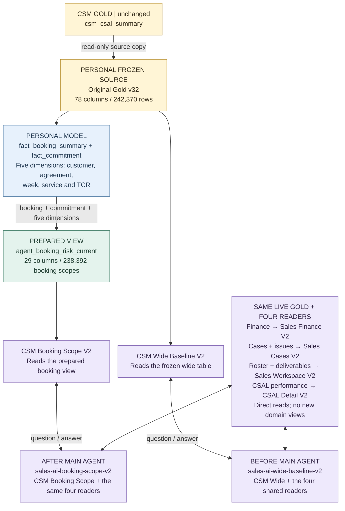

# Production and our V2 build

**Same business data. A different way to prepare it for agents.**

Read each diagram from the Gold data towards the main agent. A *fact* holds numbers at one clear row level. A *dimension* gives those numbers their customer, agreement and other labels. A *view* prepares the answerable data for a specialist agent.

## 1. Production: the documented setup

The shared Gold tables support sales analysis and workflows. The documented Sales Chat agent delegates to CSM Genie, FINCON Genie and a custom task-creation capability.

**Important:** this is the saved production design, not a fresh deployment audit. Dotted arrows show unconfirmed current bindings, not proof that every Gold table is attached to a Genie. The last saved CSM audit found legacy tables and UC functions. No separate production fact/dimension serving layer was confirmed in that audit. The task capability is shown separately; this drawing does not claim a verified direct connection from it to a particular Gold table.

Gold names above use `dev.sales_ai_assistant_gold`, except `csal_teu_performance`, which uses `dev.crmi_gold`. The physical catalog is named `dev`; these are the shared objects used by the existing implementation.

## 2. Our personal V2: what is built now

We kept production unchanged. In `usr.jayarsr`, we froze the CSM source and separated booking amounts from reviewed commitment. The AFTER agent reads a prepared booking view. The BEFORE agent reads the frozen wide table. Both main agents share the same four other readers.

The five dimensions are `dim_customer`, `dim_agreement`, `dim_week`, `dim_service` and `dim_tcr`. **Also built, outside the booking-view path:** `fact_allocation`, `dim_sales_rep` and `dim_category`. These three do not feed the current booking view.

Personal short object names mean `usr.jayarsr.<name>_poc_v2_v23`. The complete frozen-source name and shared-source mapping are below. Arrows into agents show the data they can read; double arrows show question-and-answer handoffs. These are logical connections, not database cardinalities.

**Built:** seven dimensions, three facts, one booking view, six unique specialist readers and two main agents. Each main agent has five readers. This is a partial CSM redesign, not a rebuild of every Gold domain.

**Checked:** all 238,392 booking scopes match the frozen baseline for the checked TEU measures and stored flags. The three stored rates agree with the view percentages at two decimal places.

**Benchmark complete:** C01 to C07 were asked three times through each personal main agent, giving 42 stored responses. The curated path produced 13 proven-correct answers out of 21 planned runs, compared with 12 for the wide path. Across the 18 C01-C06 table-answer runs per setup, accuracy was 72.2% versus 66.7%. Both paths were stable for three of four comparable question groups, and no clear latency winner was observed. The base LLM is managed by Databricks, so this compares the complete setups rather than proving that the data model alone caused the difference. Actual-event enrichment and swap scoring are not part of this build.

## How to explain this in the meeting

> Production stays as it is. In my personal workspace, I separated booking figures and commitment figures so each is stored at the right level, then gave the agent a smaller booking view. I tested that path against the frozen wide-table path using the same seven questions three times each. The smaller view was one answer better, while consistency and response time showed no clear winner. The right next step is to keep it as a pilot, fix the remaining response-contract issues and rerun before making any production decision.

## Exact object reference

These details are separate from the diagrams so the main story stays readable.

Personal tables, view and row meanings

All objects in this table use schema **`usr.jayarsr`**.

| Object | What one row means / role |
|---|---|
| `src_sales_ai_assistant_gold_csm_csal_summary_freeze_poc_v2_v23` | Frozen wide source; original Gold v32, personal clone v0. The `_v23` suffix is a build label. |
| `fact_booking_summary_poc_v2_v23` | Customer + agreement + reporting week + service + TCR. 238,392 rows. This is an aggregate booking scope, not one shipment. |
| `fact_commitment_poc_v2_v23` | Customer + agreement + reporting week + service. 187,388 rows. Reviewed commitment is stored once at this level. |
| `fact_allocation_poc_v2_v23` | Month + week + customer + sales representative + agreement + TCR + service + category. 242,370 rows. |
| `dim_customer_poc_v2_v23` | Customer labels. |
| `dim_agreement_poc_v2_v23` | Agreement labels. |
| `dim_week_poc_v2_v23` | Reporting-week labels. |
| `dim_service_poc_v2_v23` | Shipping-service labels. |
| `dim_tcr_poc_v2_v23` | TCR labels. |
| `dim_sales_rep_poc_v2_v23` | Sales-representative labels for allocation analysis. |
| `dim_category_poc_v2_v23` | Allocation-category labels. |
| `agent_booking_risk_current_poc_v2_v23` | Booking scope, with readable labels, amounts, percentages and stored flags. 238,392 rows and 29 columns. |

The current view joins booking to commitment on customer, agreement, week and service, then resolves five dimensions. It does not read `fact_allocation`, `dim_sales_rep` or `dim_category`. Reviewed commitment can repeat across TCR rows in the view; totals must still respect its four-key scope.

Shared Gold sources and the four unchanged readers

| Personal specialist | Exact read-only source |
|---|---|
| Sales Finance V2 | `dev.sales_ai_assistant_gold.fincon_issues` |
| Sales Cases V2 | `dev.sales_ai_assistant_gold.sales_ai_case_ledger` and `dev.sales_ai_assistant_gold.sales_ai_case_issues` |
| Sales Workspace V2 | `dev.sales_ai_assistant_gold.sales_ai_roster` and `dev.sales_ai_assistant_gold.tea_deliverables` |
| CSAL Detail V2 | `dev.crmi_gold.csal_teu_performance` |

No new facts, dimensions or serving views were built for these four readers. They read the same existing sources in both arms. Those sources are live; the CSM source is frozen. The answers must not be presented as one common historical snapshot. Neither personal supervisor has the production task-creation capability attached.

### Status and how to use this note

The diagrams describe the saved V2 build and the controlled result completed on **10 September 2026**. All 42 C01-C07 responses were stored and scored. This is not a fresh production deployment audit.

Production is shown from saved August documentation, not freshly checked live attachments. Detailed source notebooks, internal specifications and evidence captures are not included in this public copy. No corporate system was changed to prepare this note.

The 41-question and hard-scenario banks remain future coverage assets. Only the agreed seven-question booking-scope POC is complete; the other questions still require verified reference contracts before they can be treated as a controlled benchmark.

To use in Obsidian, create one Markdown note in your existing vault, paste this complete file and switch to Reading view. Keep the Mermaid fences intact. The two diagrams are architecture flows, not a claim of database cardinalities. The exact object reference above explains each fact's row level.

- [Project summary](PROJECT_SUMMARY.md)
- [Notebook guide](README.md)
- [Agent question bank](question_bank.md)
- [Controlled benchmark result](reports/csm-csal-v2-controlled-benchmark-results-2026-09-10.md)
