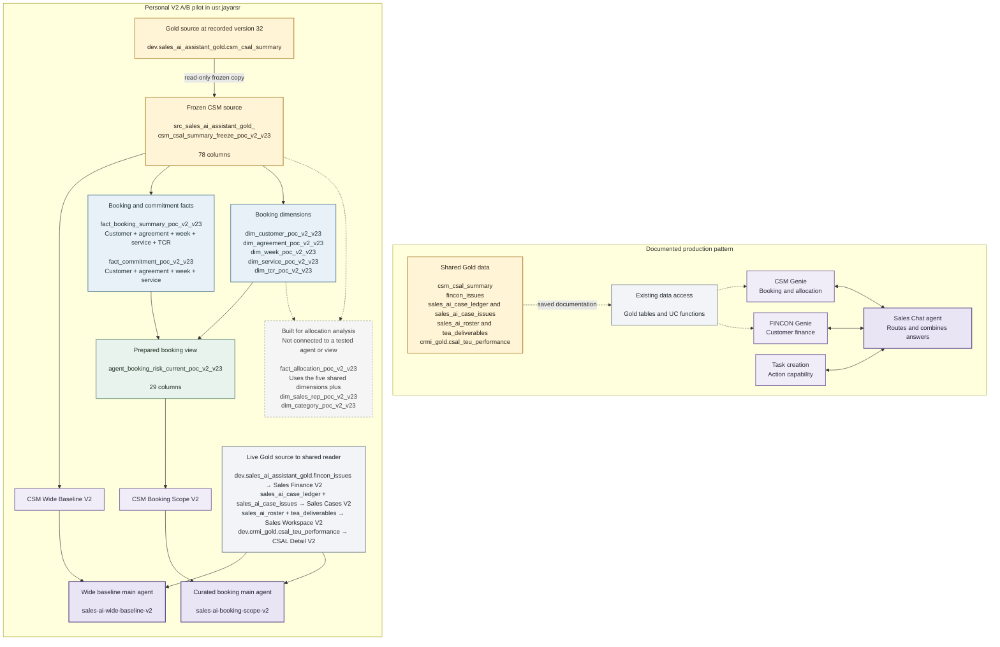

# CSM / CSAL architecture

```mermaid
%%{init: {"flowchart": {"useMaxWidth": true, "nodeSpacing": 26, "rankSpacing": 46}, "themeVariables": {"fontSize": "15px", "fontFamily": "Arial"}}}%%
flowchart TB

  subgraph PROD[Documented production pattern]
    direction LR

    PG["Shared Gold data<br/><br/>csm_csal_summary<br/>fincon_issues<br/>sales_ai_case_ledger and sales_ai_case_issues<br/>sales_ai_roster and tea_deliverables<br/>crmi_gold.csal_teu_performance"]
    PA["Existing data access<br/><br/>Gold tables and UC functions"]
    PC["CSM Genie<br/>Booking and allocation"]
    PF["FINCON Genie<br/>Customer finance"]
    PT["Task creation<br/>Action capability"]
    PM["Sales Chat agent<br/>Routes and combines answers"]

    PG -. "saved documentation" .-> PA
    PA -.-> PC
    PA -.-> PF
    PC <--> PM
    PF <--> PM
    PT <--> PM
  end

  subgraph PILOT[Personal V2 A/B pilot in usr.jayarsr]
    direction TB

    GS["Gold source at recorded version 32<br/><br/>dev.sales_ai_assistant_gold.csm_csal_summary"]

    CS["Frozen CSM source<br/><br/>src_sales_ai_assistant_gold_<br/>csm_csal_summary_freeze_poc_v2_v23<br/><br/>78 columns"]

    BF["Booking and commitment facts<br/><br/>fact_booking_summary_poc_v2_v23<br/>Customer + agreement + week + service + TCR<br/><br/>fact_commitment_poc_v2_v23<br/>Customer + agreement + week + service"]

    BD["Booking dimensions<br/><br/>dim_customer_poc_v2_v23<br/>dim_agreement_poc_v2_v23<br/>dim_week_poc_v2_v23<br/>dim_service_poc_v2_v23<br/>dim_tcr_poc_v2_v23"]

    BV["Prepared booking view<br/><br/>agent_booking_risk_current_poc_v2_v23<br/><br/>29 columns"]

    CW["CSM Wide Baseline V2"]
    CB["CSM Booking Scope V2"]

    MA["Wide baseline main agent<br/><br/>sales-ai-wide-baseline-v2"]
    MB["Curated booking main agent<br/><br/>sales-ai-booking-scope-v2"]

    SR["Live Gold source to shared reader<br/><br/>dev.sales_ai_assistant_gold.fincon_issues → Sales Finance V2<br/>sales_ai_case_ledger + sales_ai_case_issues → Sales Cases V2<br/>sales_ai_roster + tea_deliverables → Sales Workspace V2<br/>dev.crmi_gold.csal_teu_performance → CSAL Detail V2"]

    AL["Built for allocation analysis<br/>Not connected to a tested agent or view<br/><br/>fact_allocation_poc_v2_v23<br/>Uses the five shared dimensions plus<br/>dim_sales_rep_poc_v2_v23<br/>dim_category_poc_v2_v23"]

    GS -->|read-only frozen copy| CS

    CS --> CW
    CW --> MA

    CS --> BF
    CS --> BD
    BF --> BV
    BD --> BV
    BV --> CB
    CB --> MB

    SR --> MA
    SR --> MB

    CS -.-> AL
    BD -.-> AL
  end

  classDef gold fill:#FFF4D6,stroke:#A77A24,color:#2E281D,stroke-width:1.5px
  classDef access fill:#F2F4F7,stroke:#7B8794,color:#252B33,stroke-width:1.5px
  classDef model fill:#E8F1F8,stroke:#5D8195,color:#25343C,stroke-width:1.5px
  classDef view fill:#E7F3EC,stroke:#568069,color:#24352A,stroke-width:1.5px
  classDef specialist fill:#F0ECF8,stroke:#806EA2,color:#302A3C,stroke-width:1.5px
  classDef main fill:#E9E5F4,stroke:#67558D,color:#292238,stroke-width:2px
  classDef later fill:#F5F5F5,stroke:#9B9B9B,color:#424242,stroke-width:1px,stroke-dasharray:4 3

  class PG,GS,CS gold
  class PA,SR access
  class BF,BD model
  class BV view
  class PC,PF,PT,CW,CB specialist
  class PM,MA,MB main
  class AL later
```
