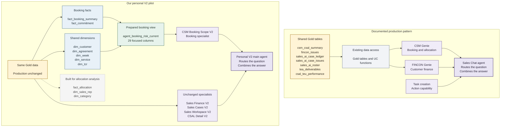

# CSM / CSAL architecture

```mermaid
%%{init: {"flowchart": {"useMaxWidth": true, "nodeSpacing": 28, "rankSpacing": 45}, "themeVariables": {"fontSize": "16px", "fontFamily": "Arial"}}}%%
flowchart TB

  subgraph PROD[Documented production pattern]
    direction LR

    PG["Shared Gold tables<br/><br/>csm_csal_summary<br/>fincon_issues<br/>sales_ai_case_ledger<br/>sales_ai_case_issues<br/>sales_ai_roster<br/>tea_deliverables<br/>csal_teu_performance"]

    PA["Existing data access<br/><br/>Gold tables and UC functions"]

    PC["CSM Genie<br/>Booking and allocation"]
    PF["FINCON Genie<br/>Customer finance"]
    PT["Task creation<br/>Action capability"]

    PM["Sales Chat agent<br/>Routes the question<br/>Combines the answer"]

    PG --> PA
    PA --> PC
    PA --> PF
    PC --> PM
    PF --> PM
    PT --> PM
  end

  subgraph V2[Our personal V2 pilot]
    direction LR

    VG["Same Gold data<br/><br/>Production unchanged"]

    VF["Booking facts<br/><br/>fact_booking_summary<br/>fact_commitment"]

    VD["Shared dimensions<br/><br/>dim_customer<br/>dim_agreement<br/>dim_week<br/>dim_service<br/>dim_tcr"]

    VV["Prepared booking view<br/><br/>agent_booking_risk_current<br/>29 focused columns"]

    VC["CSM Booking Scope V2<br/>Booking specialist"]

    VS["Unchanged specialists<br/><br/>Sales Finance V2<br/>Sales Cases V2<br/>Sales Workspace V2<br/>CSAL Detail V2"]

    VM["Personal V2 main agent<br/>Routes the question<br/>Combines the answer"]

    VL["Built for allocation analysis<br/><br/>fact_allocation<br/>dim_sales_rep<br/>dim_category"]

    VG --> VF
    VG --> VD
    VF --> VV
    VD --> VV
    VV --> VC
    VC --> VM
    VG --> VS
    VS --> VM
    VG -.-> VL
  end

  classDef gold fill:#FFF4D6,stroke:#A77A24,color:#2E281D,stroke-width:1.5px
  classDef access fill:#F2F4F7,stroke:#7B8794,color:#252B33,stroke-width:1.5px
  classDef model fill:#E8F1F8,stroke:#5D8195,color:#25343C,stroke-width:1.5px
  classDef view fill:#E7F3EC,stroke:#568069,color:#24352A,stroke-width:1.5px
  classDef specialist fill:#F0ECF8,stroke:#806EA2,color:#302A3C,stroke-width:1.5px
  classDef main fill:#E9E5F4,stroke:#67558D,color:#292238,stroke-width:2px
  classDef later fill:#F5F5F5,stroke:#9B9B9B,color:#424242,stroke-width:1px,stroke-dasharray:4 3

  class PG,VG gold
  class PA access
  class VF,VD model
  class VV view
  class PC,PF,PT,VC,VS specialist
  class PM,VM main
  class VL later
```
