# CSM CSAL V3 Grain Analysis Report

**August 2026 | Production main-agent evidence and grain validation**

## Executive summary

I reviewed the August 2026 CSM/CSAL data to understand whether repeated values at different business grains can affect answers from the production main agent.

I did not assume that every lower number was correct. For each test, I compared the agent answer with the source calculation, the value counted once at the tested business grain, and the result obtained by adding every repeated Gold row. I called something a grain failure only when the source and count-once results agreed, the agent matched the repeated result, and the supporting checks were complete.

The final result is mixed and useful:

- E01 is a confirmed grain failure.
- E07 contains a partial grain failure at TCR detail, while its parent commitment answer is correct.
- E02 and E10 are clear passes.
- E03 and E05 need more review before grain can be confirmed as the cause.
- E04, E08 and E09 do not reconcile and remain unresolved for reasons that are not proven to be grain.
- E06 has limited saved screenshot evidence. The two visible rows are correct, but the full answer is not visible.

This means the production agent is not generally wrong. The risk depends on the metric, its tested grain, its confirmed business meaning, and the calculation selected by the agent.

## Scope and decision rule

The opening grain analysis uses the August 2026 snapshot from `dev.sales_ai_assistant_gold.csm_csal_summary` at saved Delta version 80. That validation run contains 79 columns and 28,671 rows. The ten production-agent checks were captured in later evidence runs. Their values are assessed within each captured run and are not treated as if every section came from one frozen snapshot.

For each evidence case, I used the following rule:

1. Recalculate the metric from the relevant source or producer stage.
2. Count the Gold value once at the tested business grain.
3. Calculate the value across every repeated Gold row.
4. Compare all three paths with the production main-agent answer.
5. Record the case as confirmed, passed, unresolved, or another type of error.

The SQL and result panels in this report were reproduced from the executed read-only evidence notebook so that they remain readable in the document. The production-agent sections are original screenshots from the main production agent.

## What the grain analysis established

The wide Gold source contains several types of information in the same row. The August 2026 notebook identified these tested grains:

- Allocation has 28,671 rows at its tested grain, the same as the wide source.
- Booking has 28,115 grain-level rows. There are 556 repeated source rows across 544 groups.
- Commitment has 21,085 grain-level rows. There are 7,586 repeated source rows across 5,021 groups.
- Monthly performance has 10,445 grain-level rows, compared with 28,671 wide rows.
- Agreement context has 2,368 grain-level rows, compared with 28,671 wide rows.

The notebook also mapped all 79 source columns, reconstructed all 28,671 rows, passed 13 proposed primary-key checks, passed 23 foreign-key checks with no orphan rows, and passed 25 additive numerical reconciliations.

These are technical validation results. The word “correct” in the notebook charts means the tested candidate grain used in that run. It does not replace final business-owner confirmation of a metric definition.

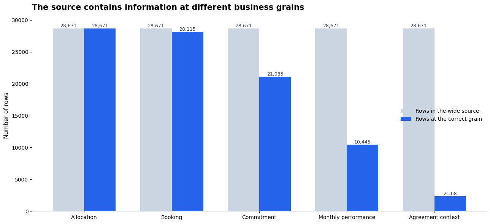

*Databricks notebook output captured from the August 2026 grain-validation run. The chart compares the wide row count with each tested business grain.*

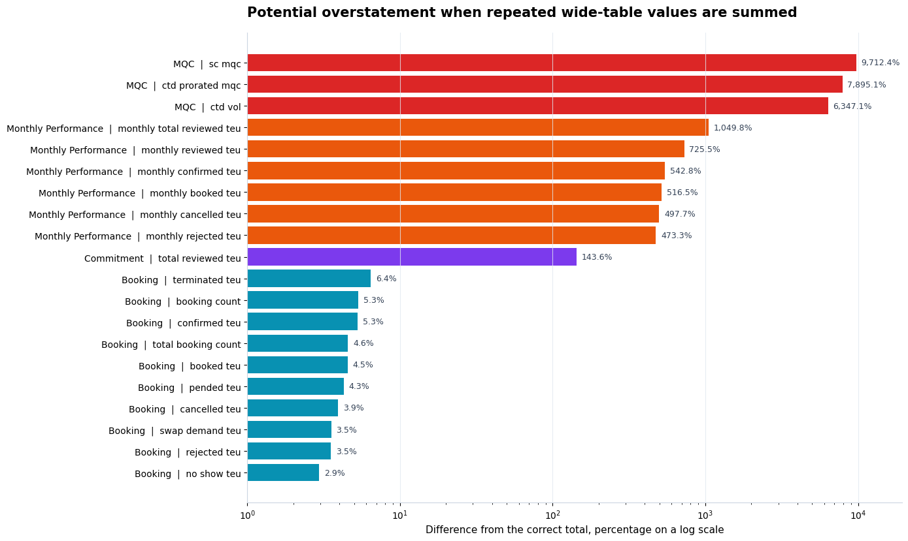

*Databricks notebook output captured from the August 2026 grain-validation run. It shows how repeated rows can change totals when a metric belongs to a higher-level grain.*

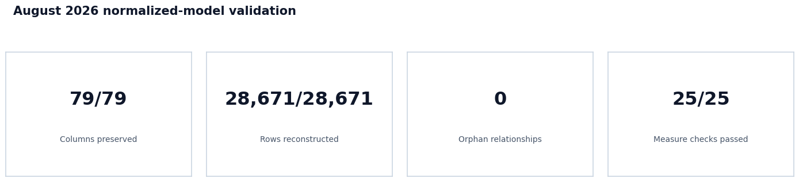

*Databricks notebook output captured from the August 2026 grain-validation run. It summarises the model-preservation and key checks.*

## Production main-agent evidence

### E01. Filtered booked TEU

**Question**

For one selected customer and agreement in week 2026WK31, service PVCS and TCR HKG, what is the booked TEU?

**Production agent result**

The agent returned 432 TEU.

**SQL validation result**

The source calculation returns 144 TEU. Counting the value once at the tested booking grain also returns 144 TEU. Adding all repeated Gold rows returns 432 TEU. No records are unresolved in this case.

**What this means**

The agent result exactly matches the repeated Gold result and is three times the source value. The source and count-once calculations agree, so the repeated Gold rows explain the difference.

**Conclusion**

Confirmed grain failure within the captured run.

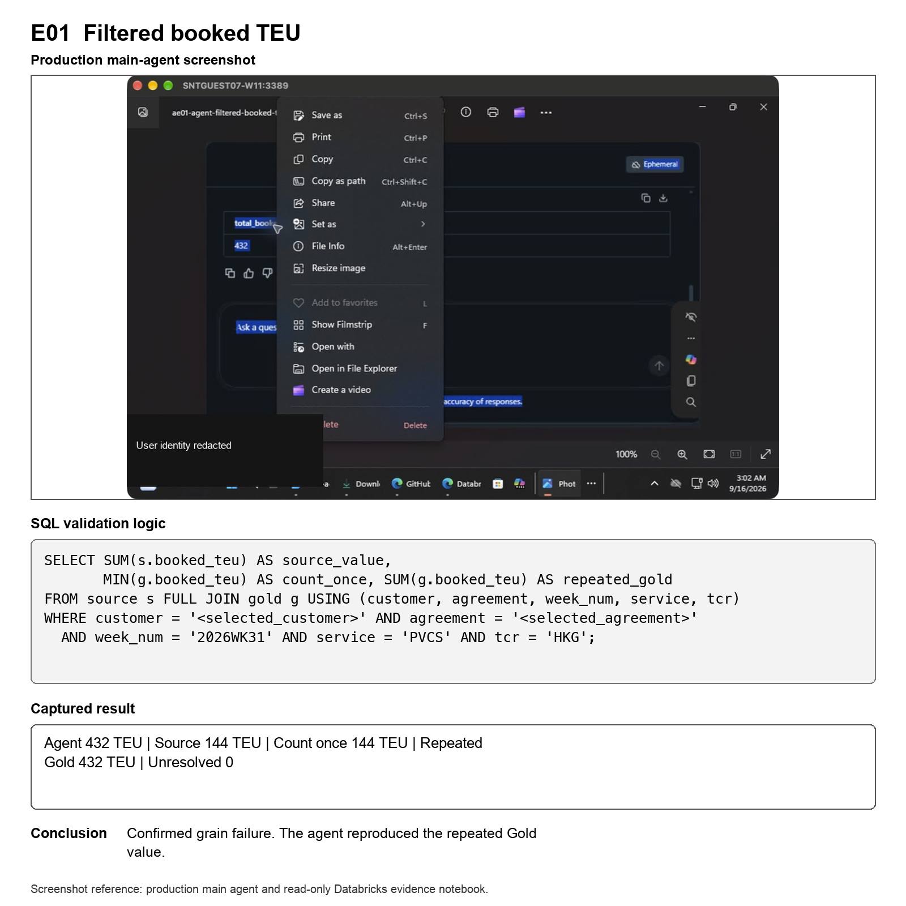

*Screenshot reference E01. Original production main-agent screenshot with the executed evidence logic and recorded notebook output reproduced below it.*

### E02. Portfolio reviewed commitment

**Question**

What is the total reviewed commitment TEU for August 2026?

**Production agent result**

The agent returned 48,389 TEU.

**SQL validation result**

The source result is 48,389 TEU, and the count-once result is also 48,389 TEU. Adding the repeated Gold rows would produce 115,396 TEU. No records are unresolved.

**What this means**

The agent used the correct commitment-level value and avoided the repeated total.

**Conclusion**

Pass.

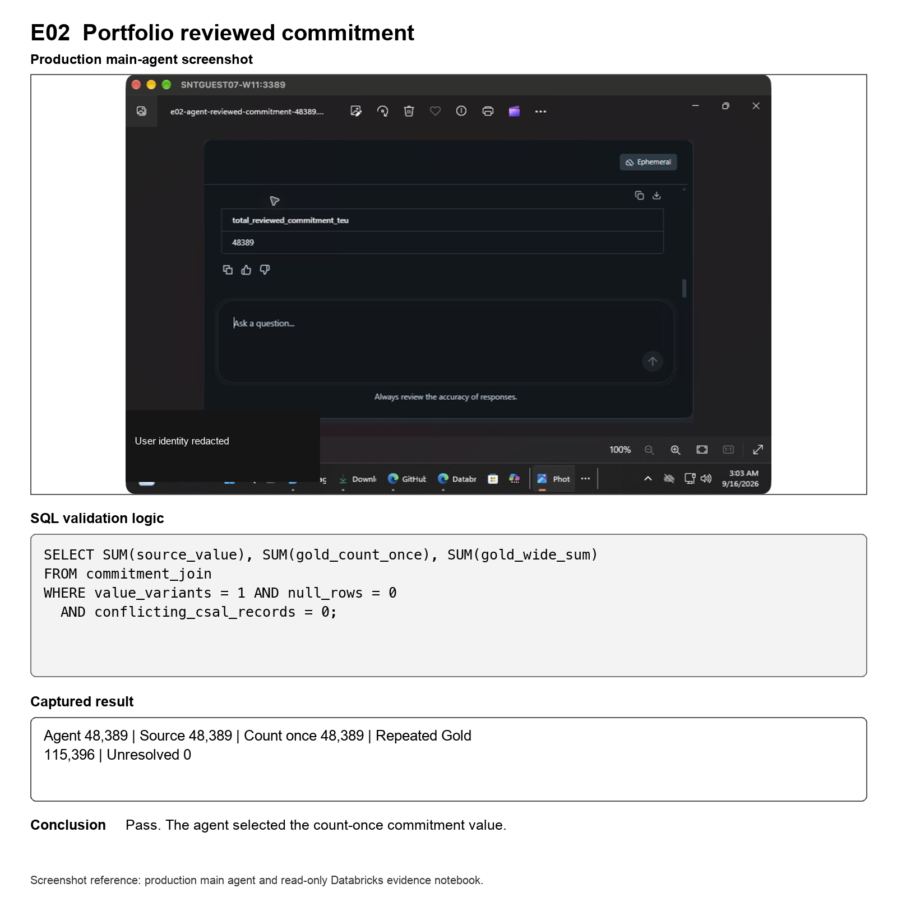

*Screenshot reference E02. Original production main-agent screenshot with the executed evidence logic and recorded notebook output reproduced below it.*

### E03. Monthly booked volume after cancellations

**Question**

For August 2026, what is the booked TEU after cancelled TEU is removed?

**Production agent result**

The current agent run returned 103,091 booked TEU and 18,125 cancelled TEU. Its net result was 84,966 TEU.

**SQL validation result**

The native booking path returns 80,166 TEU. The saved producer monthly path returns 85,162 TEU. Adding repeated monthly values in Gold returns 667,168 TEU. Nineteen groups remain unresolved.

**What this means**

The current agent result does not match the native path, the saved producer path, or the repeated Gold result. This test therefore does not prove a grain error. It shows that the agent may have selected a different calculation or scope.

**Conclusion**

Unresolved semantic selection.

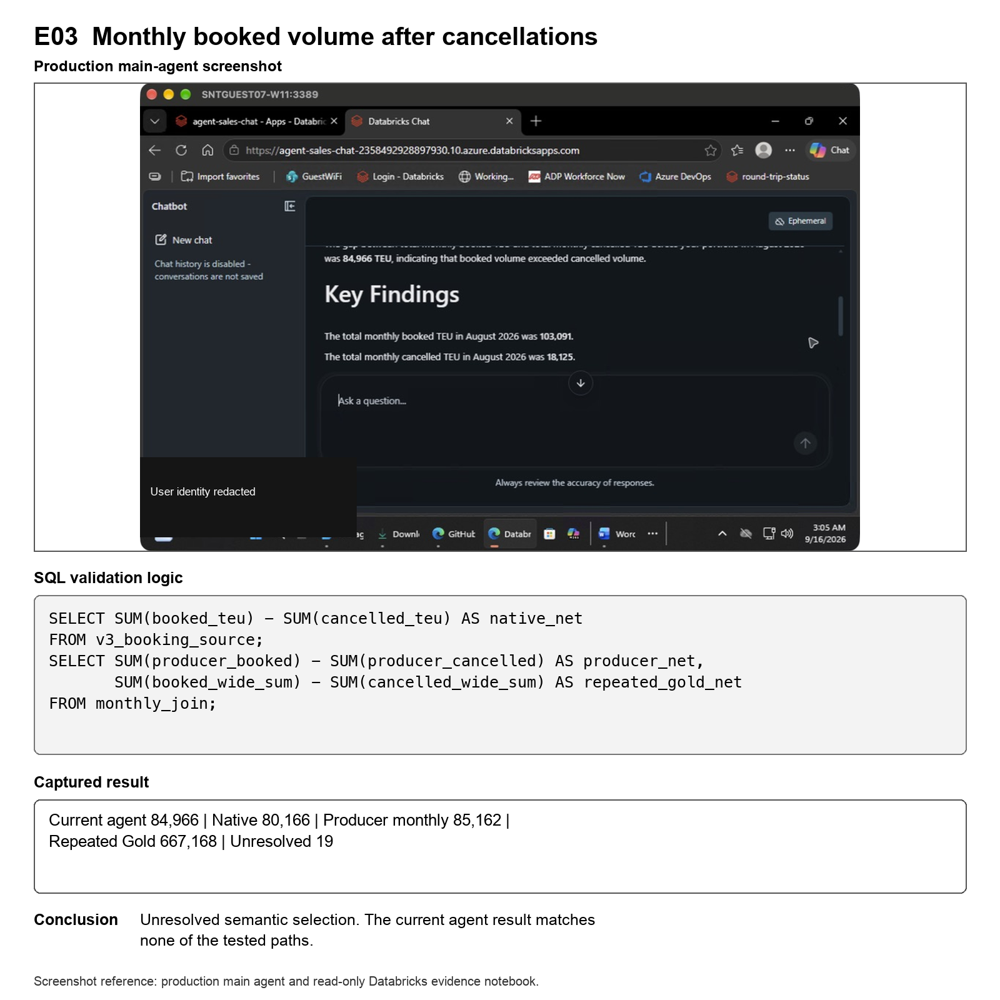

*Screenshot reference E03. Original production main-agent screenshot with the executed evidence logic and recorded notebook output reproduced below it.*

### E04. Average SC MQC per distinct agreement

**Question**

What is the average SC MQC for each distinct agreement in the August 2026 scope?

**Production agent result**

The agent returned 51.5.

**SQL validation result**

The source and count-once calculation returns an average of 3,871.579487. The raw-row average is 15,357.264326. There are 102 unresolved agreement comparisons.

**What this means**

The agent answer does not reconcile with either tested calculation. Because the supporting agreement comparisons are not fully resolved and the business definition of the average still needs confirmation, the evidence does not prove an agent error or show that row repetition caused the difference.

**Conclusion**

Does not reconcile and remains unresolved.

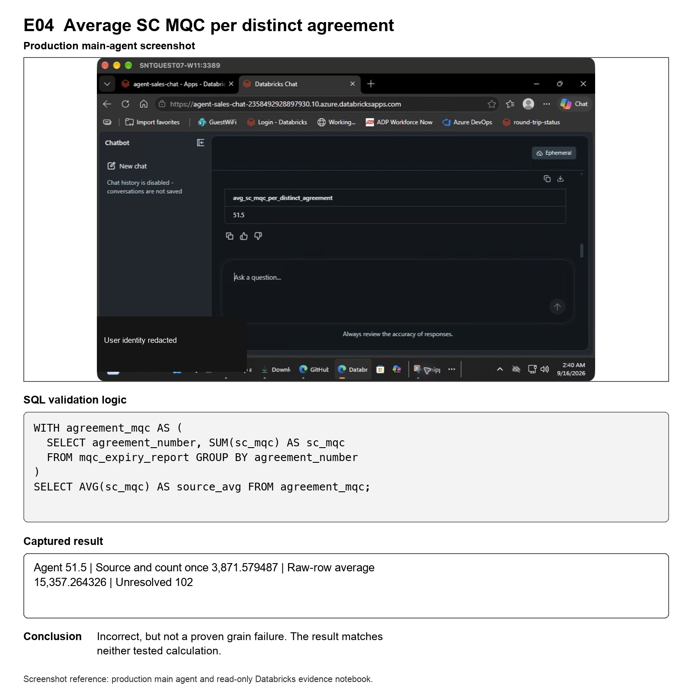

*Screenshot reference E04. Original production main-agent screenshot with the executed evidence logic and recorded notebook output reproduced below it.*

### E05. Portfolio cancellation percentage

**Question**

What percentage of August 2026 booked TEU was cancelled?

**Production agent result**

The agent returned 18,202 cancelled TEU, 103,364 booked TEU and a cancellation percentage of 17.609613%.

**SQL validation result**

The native booking calculation gives 17.033035%. The Gold count-once calculation gives 17.033388%. The calculation across repeated Gold rows gives 17.609613%. One record remains unresolved.

**What this means**

The agent percentage matches the repeated Gold calculation. This is strong evidence of repeated-row weighting, but the remaining unresolved record prevents a fully confirmed conclusion.

**Conclusion**

Unresolved grain candidate.

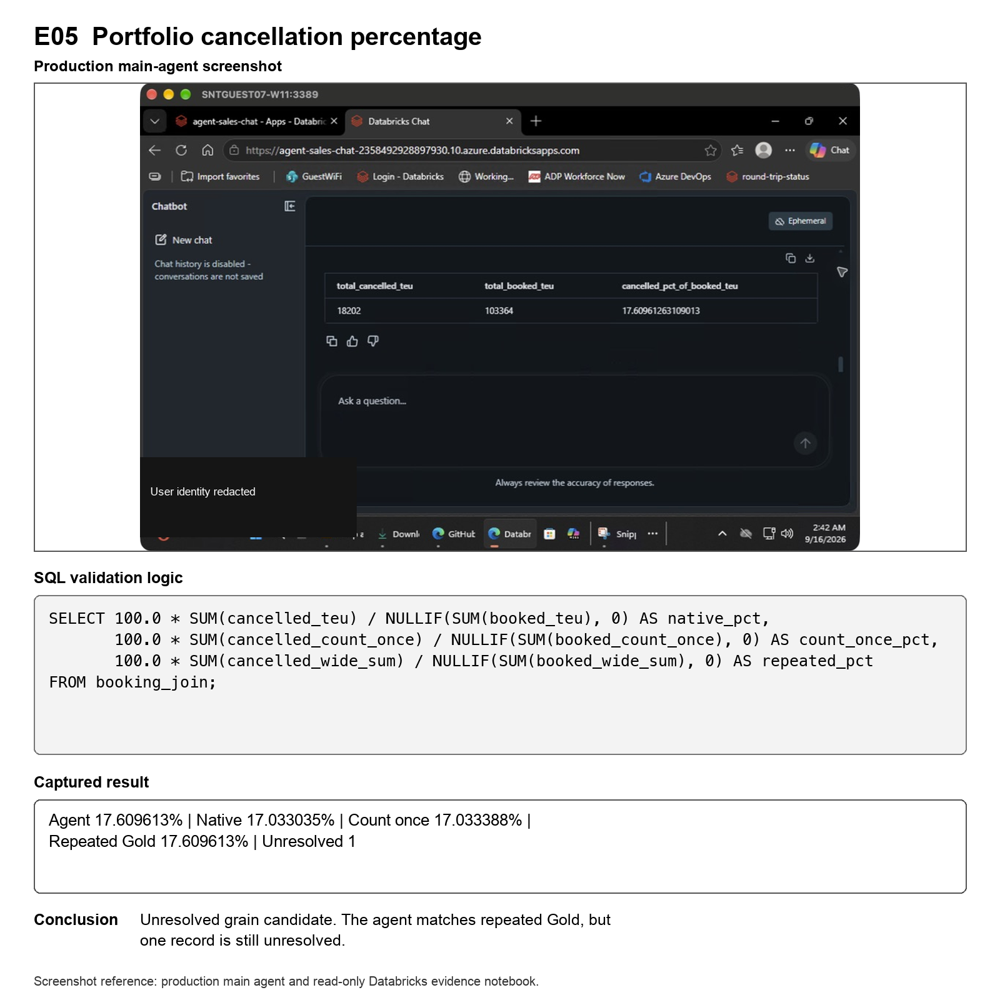

*Screenshot reference E05. Original production main-agent screenshot with the executed evidence logic and recorded notebook output reproduced below it.*

### E06. Top-five no-show ranking

**Question**

Which five customer and agreement combinations have the highest no-show TEU in August 2026?

**Production agent result**

The saved screenshot clearly shows the first two values, 72 TEU and 54 TEU. Customer identifiers are redacted in the shared report. The remaining rows are hidden by the chat box in the saved image.

**SQL validation result**

The validated top five values are 72, 54, 50, 42 and 36 TEU. Customer identifiers are redacted in the shared report. The highest unresolved candidate is 0, and there is no fifth-place tie.

**What this means**

The two visible agent rows match the validated top two. The saved screenshot does not show enough of the answer to judge the remaining three rows fairly.

**Conclusion**

Limited evidence. No failure claim is made for this case.

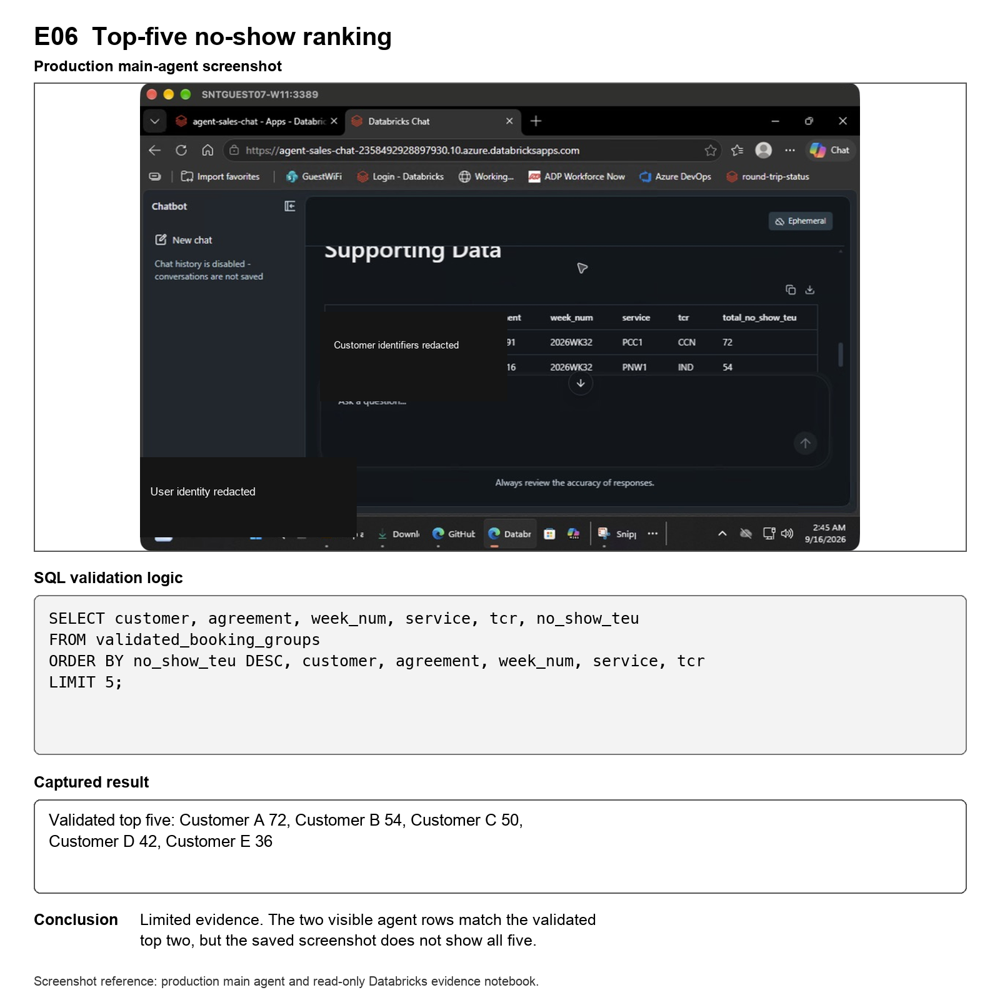

*Screenshot reference E06. Original production main-agent screenshot with the executed evidence logic and recorded notebook output reproduced below it.*

### E07. TCR detail and parent commitment

**Question**

For one selected customer and agreement in week 2026WK32 and service ECX1, what is the confirmed ECN TEU and the parent reviewed commitment?

**Production agent result**

The agent returned 112 confirmed TEU for ECN and 59 TEU for the parent reviewed commitment.

**SQL validation result**

The source and count-once ECN result is 56 TEU. The repeated ECN result is 112 TEU. The parent source and count-once result is 59 TEU, while the repeated parent value is 708 TEU.

**What this means**

At TCR detail, the agent doubled the confirmed ECN result by following the repeated Gold value. At parent level, it correctly used the 59 TEU total reviewed commitment and avoided the repeated total. These are two different metrics and are validated separately.

**Conclusion**

Partial grain failure at TCR detail. The parent commitment passes.

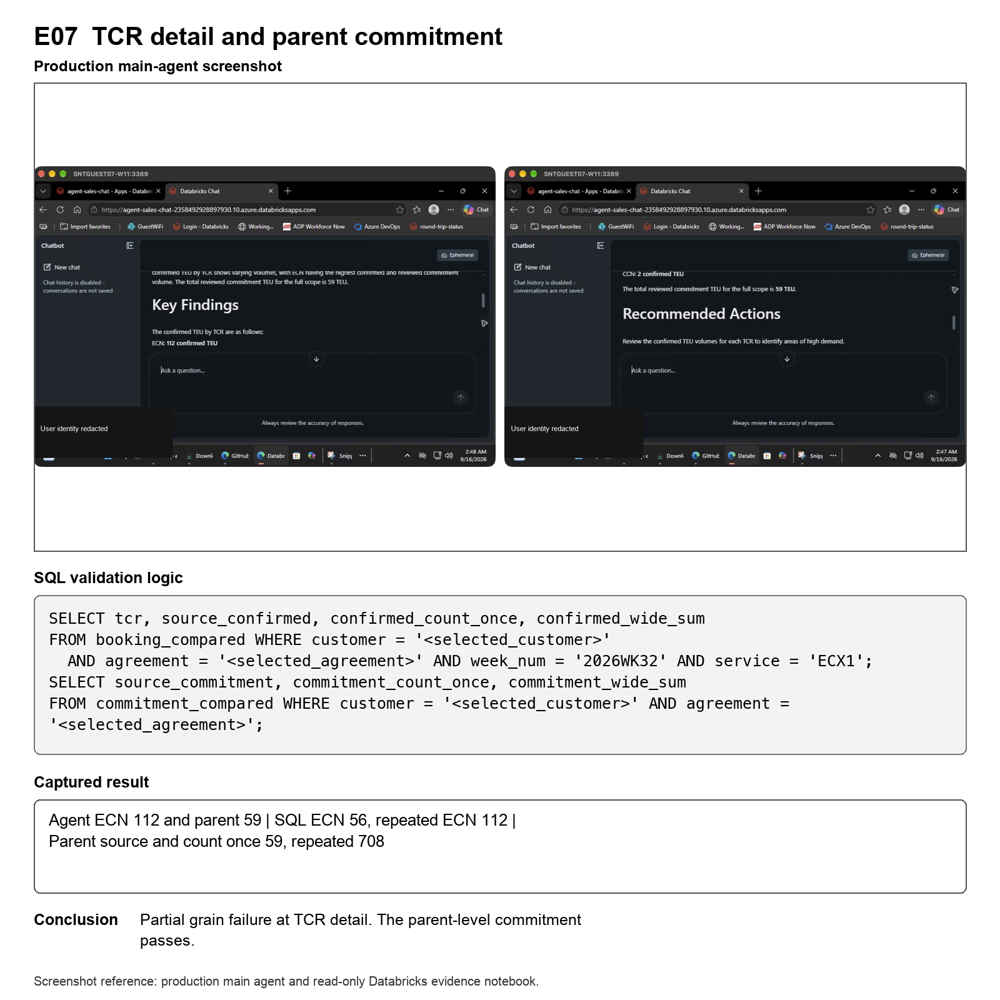

*Screenshot reference E07. Original production main-agent screenshots with the executed evidence logic and recorded notebook output reproduced below them.*

### E08. Category and volume-without-CSAL structure

**Question**

How many booking combinations span more than one category, and how many have conflicting volume-without-CSAL flags?

**Production agent result**

The agent returned 1,235 multi-category combinations and 1,163 combinations with conflicting flags.

**SQL validation result**

Across 12,403 booking combinations, the SQL found 283 combinations in multiple categories and 195 with conflicting flags.

**What this means**

Both agent counts do not reconcile with the tested SQL result. The difference does not follow a clear repeated-row multiplier, so grouping, filtering, or interpretation may also be involved.

**Conclusion**

Structural count does not reconcile. The cause is not isolated.

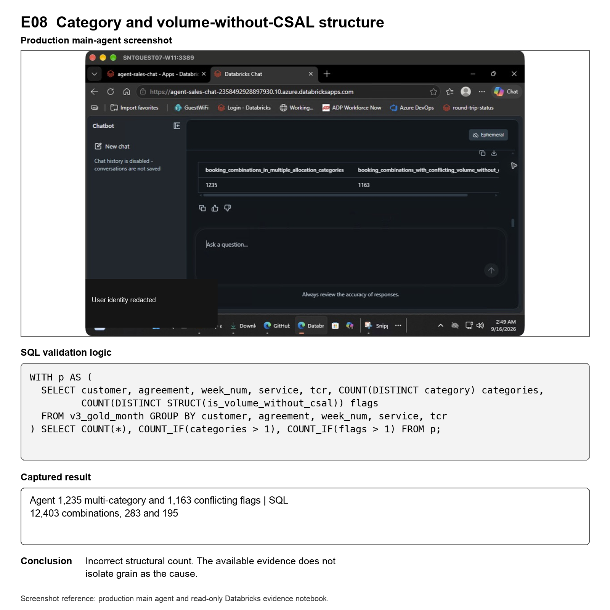

*Screenshot reference E08. Original production main-agent screenshot with the executed evidence logic and recorded notebook output reproduced below it.*

### E09. Unique active IB CSAL cases

**Question**

How many active IB CSAL monitoring cases are present when each case is counted once?

**Production agent result**

The agent returned 390. A supporting task-creation action also returned a 500 error.

**SQL validation result**

The source and count-once result is 444 unique active cases. Counting repeated Gold rows gives 12,452. Three case comparisons remain unresolved.

**What this means**

The agent result matches neither the unique-case count nor the repeated Gold total. The available evidence cannot reconstruct how 390 was produced, and the unresolved case checks prevent a stronger conclusion.

**Conclusion**

Does not reconcile and remains unresolved. This is not a confirmed grain failure.

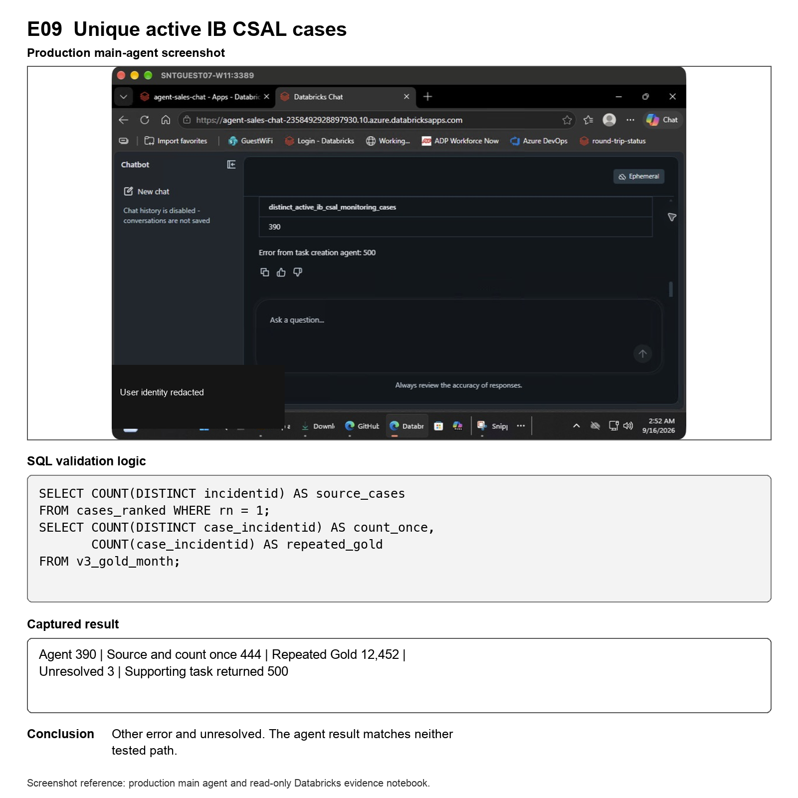

*Screenshot reference E09. Original production main-agent screenshot with the executed evidence logic and recorded notebook output reproduced below it.*

### E10. Reviewed allocation TEU control

**Question**

What is the total reviewed allocation TEU for August 2026?

**Production agent result**

The agent returned 48,389 TEU.

**SQL validation result**

The source, allocation-grain and Gold calculations all return 48,389 TEU. No records are unresolved.

**What this means**

The agent answer agrees with every validated path. This negative control confirms that not every metric is affected by repeated grains.

**Conclusion**

Pass.

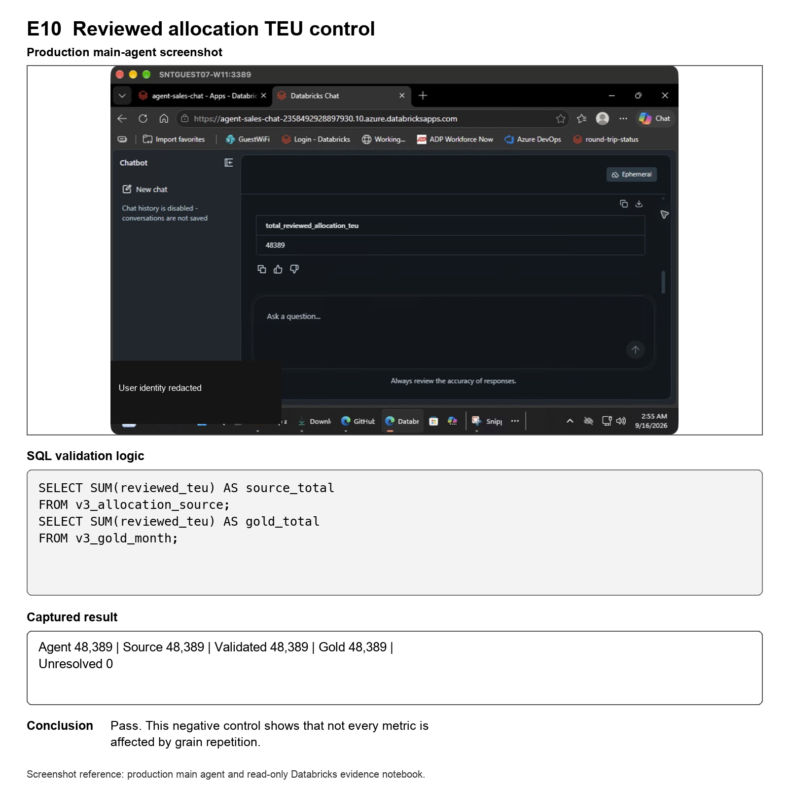

*Screenshot reference E10. Original production main-agent screenshot with the executed evidence logic and recorded notebook output reproduced below it.*

## Overall conclusion

The evidence supports a focused conclusion, not a general statement that the production agent is incorrect.

The strongest confirmed grain problem appears in E01. E07 shows that the same response can fail at a detailed grain and still pass at the parent grain. E02 and E10 prove that the agent can also select the correct level. E03, E04, E05, E06, E08 and E09 need to remain clearly separated because their limitations are different.

The practical next step is to use the tested candidate grains when building the personal fact, dimension and view model, then repeat these same questions against the new Genie configuration. Any remaining unresolved source or business-definition checks should be closed before a production recommendation is made.

## Notebook reference

[Open the detailed CSM/CSAL grain-validation notebook](https://adb-2358492928897930.10.azuredatabricks.net/editor/notebooks/1001878441092879?o=2358492928897930)

The notebook contains the detailed column mapping, grain checks, key checks, round-trip reconstruction and numerical reconciliation behind this report.
