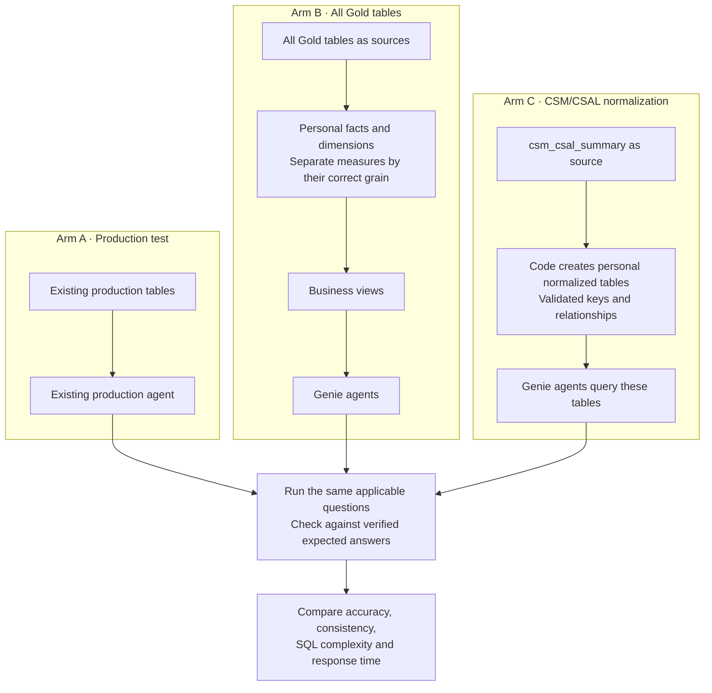

# V3: Compare Three Data and Agent Approaches

## Purpose

Compare the existing production agent with two personal implementations. Measure whether changing the data structure improves answer accuracy, consistency, query complexity and response time.

## Architecture



## Work for Each Arm

**Arm A: Test production**

Use the existing production agent with its current instructions and UC functions. Record its answers, response times and generated SQL when available. No new baseline agent is required.

**Arm B: Facts, dimensions and views**

Use all six documented Sales AI Gold tables:

- `csm_csal_summary`
- `fincon_issues`
- `sales_ai_roster`
- `sales_ai_case_ledger`
- `sales_ai_case_issues`
- `tea_deliverables`

Build the personal model by identifying what each row represents and separating measures that belong to different grains. Preserve all source columns and create business views for Genie to query.

**Arm C: Normalized CSM/CSAL tables**

Use `csm_csal_summary` as the source. Write code to create actual normalized tables in the personal workspace. Validate their keys and relationships, then connect the tables directly to Genie.

The model must preserve information available in the source. Booking or vessel identifiers already removed by aggregation cannot be recovered simply by splitting the table.

## Agent Preparation and Testing

1. Review production’s available instructions, examples and UC functions to understand its business definitions.
2. Give the personal agents equivalent business guidance, adapted to their own tables and views. Validate every join and calculation.
3. Use separate preparation questions for tuning, then freeze the configurations before running the comparison.
4. Check column coverage, record preservation, measure totals, key uniqueness and join duplication before testing.
5. Run the same CSM/CSAL questions across all three arms. Compare other Gold domains between A and B because C covers only CSM/CSAL.
6. Use identical date filters and verified expected answers. Record source timestamps so refresh differences are visible.
7. Repeat each scored question three times and retain answers, SQL when available, errors and timings.

The report will compare the complete implementations. Differences in production configuration or data freshness will be recorded alongside the results.

## Outputs

- Personal fact and dimension tables with agent views for Arm B.
- Personal normalized CSM/CSAL tables for Arm C.
- Configured Genie agents for both personal implementations.
- Validation results showing how source information is preserved.
- One comparison report covering accuracy, consistency, SQL complexity and response time.

Exact table keys, the reporting period and source versions will be established from the data before implementation. No unverified keys or business definitions will be added.

## Reuse of V2 Work

Reuse the V2 code, documentation, question bank, validation checks and agent settings wherever they fit V3. Check existing tables and views for compatibility before reusing them because V3 changes the scope and comparison.

Keep V2 intact. The V3 folder will contain the revised work and references to reusable V2 assets, avoiding unnecessary copies.

## Databricks Workspace Organization

This is the agreed folder organization. The folders and notebook entries below are proposed; they have not been created or moved as part of this plan.

```text
Your personal workspace/
│
├── Existing V2 work/
│
└── Sales_AI_V3/
    │
    ├── 00_Project/
    │   ├── Plan
    │   └── Progress
    │
    ├── 01_Data_Review/
    │   ├── 01_Source_Inventory
    │   └── 02_Column_and_Grain_Review
    │
    ├── 02_Arm_A_Production_Test/
    │   └── 01_Production_Agent_Test
    │
    ├── 03_Arm_B_Facts_Dimensions_Views/
    │   ├── 01_Build_Dimensions
    │   ├── 02_Build_Facts
    │   ├── 03_Build_Agent_Views
    │   └── 04_Validate_Model
    │
    ├── 04_Arm_C_Normalized_CSAL/
    │   ├── 01_Build_Normalized_Tables
    │   └── 02_Validate_Model
    │
    ├── 05_Genie_Configuration/
    │   ├── Arm_B_Instructions_and_Examples
    │   ├── Arm_C_Instructions_and_Examples
    │   └── Agent_and_UC_Function_Register
    │
    └── 06_Benchmark/
        ├── 01_Question_Bank_and_Expected_Answers
        ├── 02_Run_Comparison
        └── 03_Results_and_Charts
```

Databricks workspace folders hold notebooks and documents. Actual tables and views live in the personal catalog schema, and Genie agents are separate assets referenced in the project register.
