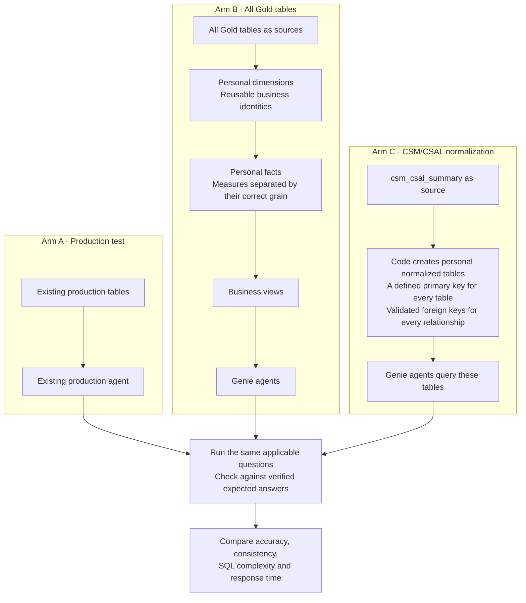

# V3: Compare Three Data and Agent Approaches

## Purpose

Compare the existing production agent with two personal implementations. Measure whether changing the data structure improves answer accuracy, consistency, query complexity and response time.

All personal V3 objects belong under `usr.jayarsr`. `madabra` is not the project owner or target. The current evidence phase is read-only and creates no table or view.

## Current Position

The project is about one third complete as an end-to-end V3 comparison. The analysis and feasibility work are well advanced, but the source-aligned implementation and fair three-arm benchmark are still pending.

- **Planning and technical feasibility:** approximately 70% complete.
- **Source-aligned implementation:** approximately 20% complete.
- **Full V3 comparison:** approximately 35% complete overall.

These percentages describe the work completed, not the quality of any agent. No production accuracy conclusion has been approved yet.

### Work completed so far

- Documented the six Sales AI Gold tables currently in scope.
- Saved the `csm_csal_summary` schema, its 79 supplied columns and the available producer notebook.
- Profiled an August sample and tested candidate row definitions across all 79 columns.
- Identified candidate grains for allocation, booking, commitment, monthly performance and agreement context.
- Confirmed that different metric groups behave at different grains. One grain does not correctly represent every column.
- Mapped all 79 source columns to eight draft dimensions and five draft facts.
- Tested technical primary keys and foreign-key relationships in the earlier sample. The tested keys were unique and the tested relationships had no orphan rows.
- Reconstructed all 79 columns and all 28,671 rows from the earlier sample model without dropping source information.
- Reconciled the draft fact totals with the matching grain-aware source calculations.
- Measured where direct sums from the wide table differ from tested grain-aware totals.
- Collected ten saved production-agent examples covering monthly and booking measures.
- Created the grain-analysis report and documented the limitations caused by different source versions.

### Important limits on the completed work

- The full reconstruction and key proof used an earlier source version.
- The current grain review, earlier model build and saved agent evidence do not all use the same source version.
- The saved production-agent answers cannot yet be called incorrect because the exact generated SQL and identical source snapshot are not available for every case.
- The candidate grains are strongly supported by the sample data, but they still need to be reconciled with the upstream producer logic.
- Draft technical keys are not enterprise business identifiers unless the source owner confirms them.

## Architecture



## Work for Each Arm

**Arm A: Test production**

Use the existing production agent with its current instructions and UC functions. Record its answers, response times and generated SQL when available. No new baseline agent is required.

**Arm B: Facts, dimensions and views**

Use all six documented Sales AI Gold tables:

- `csm_csal_summary`
- `fincon_issues`
- `sales_ai_roster`
- `sales_ai_case_ledger`
- `sales_ai_case_issues`
- `tea_deliverables`

Build the personal model by identifying what each row represents and separating measures that belong to different grains. Preserve all source columns and create business views for Genie to query.

**Arm C: Normalized CSM/CSAL tables**

Use `csm_csal_summary` as the source. Write code to create actual normalized tables in the personal workspace. Validate their keys and relationships, then connect the tables directly to Genie.

Every normalized table must have a clearly defined primary key that uniquely identifies each row. Every relationship between tables must use a corresponding foreign key. A table is accepted only after the primary key is proven unique and non-null, and every populated foreign key is proven to match its parent table. Any unmatched or ambiguous relationship must be reported and resolved rather than silently removed.

The model must preserve information available in the source. Booking or vessel identifiers already removed by aggregation cannot be recovered simply by splitting the table.

## Upstream Grain-Proof Plan

The next priority is to validate each proposed grain against the upstream data used to create `csm_csal_summary`. This is stronger than selecting a lower total from the final Gold table.

### Step 1: Freeze one comparable data snapshot

1. Select one complete reporting month.
2. Record the Delta version or equivalent refresh timestamp for the Gold table and every upstream source used in the producer logic.
3. Use the same filters, timezone and included-record rules in every comparison.
4. Stop the comparison if the snapshots cannot be aligned.

### Step 2: Build a metric-lineage register

Read the saved producer notebook and record, for every tested metric:

- the upstream source table
- the source columns used
- the calculation performed
- the native grouping or partition columns
- filters and exclusions
- joins that can expand the number of rows
- whether the metric is additive, non-additive or descriptive

Start with the ten metrics already used in the evidence report:

- monthly booked, cancelled, rejected and confirmed TEU
- booked, confirmed, cancelled, rejected, no-show and terminated TEU

### Step 3: Calculate the upstream reference value

For each metric, query the upstream source at the native grain shown by the producer logic. Apply the same month and record filters as the Gold-table test.

The upstream query must calculate the metric before joins that introduce lower-level details. It must not use `MAX` as a shortcut unless the producer logic or an approved rule explicitly requires it.

### Step 4: Recalculate the Gold-table grain-aware value

For each proposed grain:

1. Group the Gold rows by the candidate key.
2. Count the distinct metric values inside every group, including null-safe checks.
3. Accept a group only when it contains one consistent metric value.
4. Report conflicting groups rather than choosing a value silently.
5. Count each consistent group once and sum those values to produce the tested grain-aware result.

For booking measures, the current candidate is customer, agreement, reporting week, service and TCR. Include month whenever more than one month is queried. This remains a candidate until the upstream test is complete.

### Step 5: Run the four-way comparison

For every question, retain four independently traceable values:

1. **Agent answer:** the value presented by the production agent.
2. **Agent SQL result:** the result of running the exact SQL generated by the production agent.
3. **Gold grain-aware result:** the value calculated once per validated Gold-table grain.
4. **Upstream reference result:** the value calculated directly from the upstream source at its native grain.

Interpret the results as follows:

- If all four values match, the question does not show a grain-related difference.
- If the agent answer matches its SQL, while the Gold grain-aware result matches the upstream result, the difference is consistent with row repetition in the wide table.
- If the agent answer does not match its own SQL, investigate the agent response or execution path before discussing grain.
- If the Gold grain-aware result does not match the upstream result, revise the proposed grain or reproduce the missing producer transformation.
- If source snapshots differ, mark the comparison invalid and rerun it.

### Step 6: Complete the technical proof

A metric grain is technically supported only when all of these checks pass:

- one consistent metric value exists per proposed grain group
- missing key rows have an explicit, tested treatment
- the producer lineage supports the same row definition
- the upstream and Gold grain-aware results reconcile
- the fact model preserves every source value and relationship needed for reconstruction
- no join introduces unexplained row multiplication

Business review then confirms that the technically supported row definition matches the intended reporting meaning. The review does not replace the technical evidence.

## Remaining Build Sequence

1. Complete the upstream grain proof for the ten evidence metrics.
2. Extend the same proof to the remaining CSM/CSAL metric groups.
3. Rerun the 79-column mapping, key checks and round-trip reconstruction on the frozen comparison snapshot.
4. Build Arm B facts, dimensions and business views from all six Gold tables.
5. Build Arm C normalized CSM/CSAL tables with tested primary and foreign keys.
6. Configure the Arm B and Arm C Genie agents with equivalent instructions, examples and applicable UC functions.
7. Freeze all three agent configurations before scoring.
8. Run the same applicable questions three times across the three arms.
9. Compare accuracy, consistency, response time and SQL complexity.
10. Produce the final report with query evidence, source versions, limitations and recommendations.

## Agent Preparation and Testing

1. Review production’s available instructions, examples and UC functions to understand its business definitions.
2. Give the personal agents equivalent business guidance, adapted to their own tables and views. Validate every join and calculation.
3. Use separate preparation questions for tuning, then freeze the configurations before running the comparison.
4. Check column coverage, record preservation, measure totals, key uniqueness and join duplication before testing.
5. Run the same CSM/CSAL questions across all three arms. Compare other Gold domains between A and B because C covers only CSM/CSAL.
6. Use identical date filters and verified expected answers. Record source timestamps so refresh differences are visible.
7. Repeat each scored question three times and retain answers, SQL when available, errors and timings.

The report will compare the complete implementations. Differences in production configuration or data freshness will be recorded alongside the results.

## Outputs

- Personal fact and dimension tables with agent views for Arm B.
- Personal normalized CSM/CSAL tables for Arm C.
- Arm C key-validation results covering primary-key uniqueness, null keys and foreign-key integrity.
- Configured Genie agents for both personal implementations.
- Validation results showing how source information is preserved.
- One comparison report covering accuracy, consistency, SQL complexity and response time.

Exact table keys, the reporting period and source versions will be established from the data before implementation. No unverified keys or business definitions will be added.

## Reuse of V2 Work

Reuse the V2 code, documentation, question bank, validation checks and agent settings wherever they fit V3. Check existing tables and views for compatibility before reusing them because V3 changes the scope and comparison.

Keep V2 intact. The V3 folder will contain the revised work and references to reusable V2 assets, avoiding unnecessary copies.

## Databricks Workspace Organization

This is the agreed folder organization. The folders and notebook entries below are proposed; they have not been created or moved as part of this plan.

```text
Your personal workspace/
│
├── Existing V2 work/
│
└── Sales_AI_V3/
    │
    ├── 00_Project/
    │   ├── Plan
    │   └── Progress
    │
    ├── 01_Data_Review/
    │   ├── 01_Source_Inventory
    │   └── 02_Column_and_Grain_Review
    │
    ├── 02_Arm_A_Production_Test/
    │   └── 01_Production_Agent_Test
    │
    ├── 03_Arm_B_Facts_Dimensions_Views/
    │   ├── 01_Build_Dimensions
    │   ├── 02_Build_Facts
    │   ├── 03_Build_Agent_Views
    │   └── 04_Validate_Model
    │
    ├── 04_Arm_C_Normalized_CSAL/
    │   ├── 01_Build_Normalized_Tables
    │   └── 02_Validate_Model
    │
    ├── 05_Genie_Configuration/
    │   ├── Arm_B_Instructions_and_Examples
    │   ├── Arm_C_Instructions_and_Examples
    │   └── Agent_and_UC_Function_Register
    │
    └── 06_Benchmark/
        ├── 01_Question_Bank_and_Expected_Answers
        ├── 02_Run_Comparison
        └── 03_Results_and_Charts
```

Databricks workspace folders hold notebooks and documents. Actual tables and views live in the personal catalog schema, and Genie agents are separate assets referenced in the project register.
