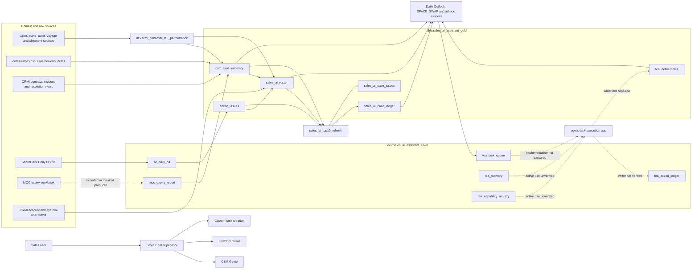

# Sales AI: Complete Current Context for Copilot Architecture Review

## Instructions for Copilot Chat

Use this document as a dated evidence pack for discussing the Sales AI data architecture. It is not permission to create or change anything.

Follow these rules in every response:

1. Use only facts stated in this document or in evidence the user provides later.
2. Separate your statements into `VERIFIED FROM SAVED EVIDENCE`, `PROPOSED`, and `UNVERIFIED` whenever those categories are relevant.
3. Do not infer a primary key, foreign key, grain, active producer, schedule, agent attachment or business rule from a column name.
4. Do not silently choose between conflicting schema versions. Ask for a current read-only Databricks check.
5. Do not invent missing definitions. Say exactly what is unknown.
6. If a design decision depends on missing information, ask one precise question and wait for the answer.
7. Do not create SQL, notebooks, tables, views, functions, agents, jobs or configuration unless the user explicitly asks after the design is agreed.
8. Never recommend changing production during this architecture discussion. Any proof of concept must use the approved personal workspace.
9. Do not treat an LLM answer as ground truth. Business calculations and expected results require source evidence and independent review.
10. Use the exact table and column names shown here. When a name is disputed, show both captured names and ask for verification.
11. Never average percentages, add cumulative FinCon aging bands or sum a measure after joining it below its declared grain.
12. Never describe the current swap fields as a probability, guaranteed capacity, reserved capacity or an executable recommendation.
13. Never claim that a narrow agent view causes data loss if the complete underlying model and compatibility views preserve every source field.
14. Never claim that normalization will automatically improve latency. Spark performance depends on scans, joins, file layout, caching, statistics, warehouse state and generated SQL.
15. When evidence is insufficient, use this wording: `I cannot verify that from the supplied material. Please provide or approve a read-only check of <exact object or property>.`

When the user asks for an architecture idea, answer in this order:

1. What the evidence currently proves.
2. What is still unknown.
3. The smallest reasonable proposal.
4. The trade-offs of that proposal.
5. The exact read-only checks needed before implementation.

## Purpose of this context file

The user is considering a V3 proof of concept for the complete Sales AI Gold dataset. The aim is to compare three data-access patterns over the same frozen sample:

1. The current Gold structure.
2. Normalized facts, dimensions and relationship bridges.
3. Curated domain views built over the normalized model.

The test must include all documented Sales AI Gold columns. A focused agent view may expose fewer columns, but every source column must remain mapped and reconstructable elsewhere. Production stays read-only.

This file gives Copilot the current saved architecture, complete documented Gold column dictionary, direct CRMI Gold input, agent and function context, known risks and unanswered questions. It does not replace a fresh live inventory.

## Evidence boundary

| Evidence | Date | What it proves | What it does not prove |
|---|---|---|---|
| Complete CSM and CRMI producer captures | 2026-08-27 | Captured notebook source, 78-column CSM DDL, 31-column CRMI DDL and visible transformations | That the same revisions are deployed today or are the only writers |
| Gold table, lineage, function and CSM Genie inspection | 2026-08-24 | Objects and attachments visible on that date | Current 2026-09-10 configuration |
| Full Gold/Silver sample and lineage pack | 2026-08-26 | Saved schemas, sample-supported relationships and known defects | Live counts, constraints or current refresh state |
| Production chat smoke observation | 2026-09-09 to 2026-09-10 | `agent-sales-chat` responded to questions | Which specialist, SQL, source, model or snapshot produced each answer |

The term **current** in this file means the latest saved evidence, not a new live check made today.

## Current documented table scope

### Sales AI Gold tables

| Table | Latest documented column count | Current role in the saved design |
|---|---:|---|
| `dev.sales_ai_assistant_gold.csm_csal_summary` | 78 | Wide CSM serving table combining allocation, booking, commitment, MQC, CRM, risk, swap and monthly context |
| `dev.sales_ai_assistant_gold.fincon_issues` | 11 | Customer accounts-receivable issue summary |
| `dev.sales_ai_assistant_gold.sales_ai_roster` | 9 | Effective-dated customer and sales-representative assignment relationship |
| `dev.sales_ai_assistant_gold.sales_ai_case_ledger` | 41 | Parent Sales AI case state |
| `dev.sales_ai_assistant_gold.sales_ai_case_issues` | 30 | Child issue state under Sales AI cases |
| `dev.sales_ai_assistant_gold.tea_deliverables` | 11 | Versioned task-execution deliverables |
| **Documented total** | **180** | Uses the latest captured 78-column CSM producer and newer roster field name |

### Direct upstream Gold table used by CSM

| Table | Latest documented column count | Role |
|---|---:|---|
| `dev.crmi_gold.csal_teu_performance` | 31 | Booking, allocation, sailing and cutoff detail used to build CSM and roster context |

The direct upstream table is included in this context because it retains identifiers such as `csal_id`, `booking_number`, `svvd` and `vessel_code` that the CSM summary aggregates away. It is not automatically part of the six-table Sales AI Gold normalization boundary.

### Sales AI Silver and operational tables visible in saved evidence

| Table | Saved role | Evidence limitation |
|---|---|---|
| `dev.sales_ai_assistant_silver.ar_daily_os` | Daily AR input to FinCon | Current producer is masked; exact live grain is unverified |
| `dev.sales_ai_assistant_silver.ar_weekly_os` | Intended weekly AR detail | No verified current Gold consumer was observed |
| `dev.sales_ai_assistant_silver.mqc_expiry_report` | MQC input to CSM | Workbook producer is masked; snapshot contract needs verification |
| `dev.sales_ai_assistant_silver.tea_task_queue` | Task queue used by Daily Outlook, swap and ad-hoc runners | App claim and update behavior was not captured |
| `dev.sales_ai_assistant_silver.tea_memory` | Intended task and agent memory | Current operational writer and reader are unverified |
| `dev.sales_ai_assistant_silver.tea_action_ledger` | Intended execution audit | No active writer was verified |
| `dev.sales_ai_assistant_silver.tea_capability_registry` | Capability definitions | Two v2.0 entries were seen, but active caller use was not verified |

This document does not claim complete column dictionaries for those Silver tables. They are upstream or operational dependencies, not the six-table Gold target. If the requested design expands to normalize Silver, ask for a separate complete read-only Silver inventory first.

## Current saved architecture



Solid arrows are supported by captured code, Catalog lineage or saved sample evidence. Dashed arrows are intended, masked or unverified. An arrow is a data-flow relationship, not proof of a physical foreign key.

## Current producer and consumer register

| Target | Saved producer or source path | Saved downstream use | Confidence limit |
|---|---|---|---|
| `dev.crmi_gold.csal_teu_performance` | Captured notebook `csal_teu_performance`; ten direct operational inputs listed below | CSM summary, roster and CSM drill-down | Current writer and schedule are unverified |
| `dev.sales_ai_assistant_gold.csm_csal_summary` | Notebook `sales_ai_assistant.csm_csal_summary`, ID `4432716228545088`; observed job `781567069434498`, daily 04:30 America/Los_Angeles | Roster, top-10 refresh, case generation and swap runners | Captured source does not prove current deployment revision |
| `dev.sales_ai_assistant_gold.fincon_issues` | Silver `ar_daily_os` plus a masked producer | Roster, top-10 refresh and cases | Historical SQL exists, but active producer is unverified |
| `dev.sales_ai_assistant_gold.sales_ai_roster` | CRMI account/user context plus CSM, FinCon and CRMI CSAL performance | Top-10 refresh and representative resolution | Producer notebook and current schedule are unresolved |
| `dev.sales_ai_assistant_gold.sales_ai_case_ledger` | DDL notebook `sales_ledger_tables_updated`; mutated by `sales_ai_top10_refresh` | Issues, Daily Outlook and ad-hoc runners | Physical uniqueness and complete lifecycle behavior are unverified |
| `dev.sales_ai_assistant_gold.sales_ai_case_issues` | Same DDL and top-10 refresh process | Case lifecycle and reported case/UI flows | Logical parent relationship only; no physical FK observed |
| `dev.sales_ai_assistant_gold.tea_deliverables` | DDL notebook `tea_tables`; intended external task-execution writer | Ad-hoc and SPACE_SWAP flows | Current Gold writer and notification bridge were not proven |

### Direct sources captured for `csal_teu_performance`

1. `datasources.csal.csal_sales_profile`
2. `datasources.csal.csal_plan`
3. `datasources.csal.csal_audit_trail`
4. `datasources.csal.csal_plan_no_csal`
5. `datasources.csal.csal_vessel_voyage`
6. `datasources.csal.csal_voy_stop_dtl`
7. `datasources.csal.cor_year_month_week`
8. `datasources.dimsa_dm_pb_shp.dimsa_pb_shp_mvmt`
9. `datasources.dimsa_dm_pb_shp.dimsa_pb_shp_shipment`
10. `datasources.cisp.org_flattn_hierarchy`

Older evidence spells the two shipment objects as `datasources.dmsa_dm_pb_shp.dmsa_*`. The later visual producer capture spells them `datasources.dimsa_dm_pb_shp.dimsa_*`. Copilot must not choose a spelling until Databricks confirms the live object names.

### Direct sources captured for `csm_csal_summary`

1. `dev.crmi_gold.csal_teu_performance`
2. `datasources.csal.csal_booking_detail`
3. `dev.crmi_gold.oocl_casereference_v`
4. `dev.crmi_gold.incident_v`
5. `dev.crmi_gold.incidentresolution_v`
6. `dev.sales_ai_assistant_silver.mqc_expiry_report`

## Current logical grains and relationships

| Object | Saved grain evidence | What must not be assumed |
|---|---|---|
| `csal_teu_performance` | Booking-level when booking information exists, with allocation context repeated; unmatched rows can have null `csal_id` | `csal_id + booking_number` uniqueness is not proven |
| `csm_csal_summary` | Intended allocation-driven month, week, customer, rep, agreement, TCR, service and category row | No physical key; booking, commitment, MQC, CRM and monthly values repeat at other grains |
| `fincon_issues` | Candidate normalized customer, sales context and latest snapshot date | Current uniqueness and multi-rep behavior are unverified |
| `sales_ai_roster` | Effective-dated rep/customer assignment relationship | It is not one customer to exactly one rep; no non-overlap rule was verified |
| `sales_ai_case_ledger` | Candidate `case_id`; intended current case by customer natural key | Customer natural-key uniqueness is not proven; duplicate natural keys were seen in saved evidence |
| `sales_ai_case_issues` | Candidate `case_issue_id` with logical parent `case_id` | No PK or FK is physically verified; customer plus issue type is too coarse for all business contexts |
| `tea_deliverables` | Candidate `deliverable_id`; multiple versions may share a task | At-most-one-current enforcement is not verified |

Important relationship rules:

- `csm_csal_summary.case_incidentid` is a CRMI monitoring incident. It is not `sales_ai_case_ledger.case_id`.
- Booking values can repeat across CSM allocation sales/category rows because the booking aggregate does not contain those fields.
- `total_reviewed_teu` repeats across TCR/category rows and must be counted once at customer, agreement, week and service grain.
- MQC values repeat across matching weekly CSM rows and remain agreement-level context.
- FinCon 30, 60 and 90-day fields are cumulative bands. Do not add them together.
- Roster is a many-to-many relationship and can multiply name-based joins.
- Allocation values repeat beside booking rows in CRMI CSAL performance. Do not sum them at booking-row grain without a grain-safe collapse.

## Current agent architecture

Saved product documentation describes this pattern:

```text
Sales user
    |
    v
Custom Sales Chat supervisor
    |
    +------------------+--------------------+
    |                  |                    |
    v                  v                    v
FINCON Genie       CSM Genie        Custom task creation
    |                  |                    |
    +------------------+--------------------+
                       |
                       v
             Supervisor combines the answer
```

The two Genie spaces can be exposed as MCP servers, but the captured supervisor design invoked them through ordinary APIs. This does not prove the current runtime integration remains unchanged.

The CSM Genie configuration observed on 2026-08-24 showed seven legacy tables and six UC functions. A later Story 4950 source configuration recorded the target CSM summary, MQC Silver table and CRMI CSAL performance table together with the same six functions. These are dated observations. A fresh live attachment inventory is required before V3.

Production `agent-sales-chat` answered smoke-test questions on 2026-09-09 and 2026-09-10. The selected specialist, SQL, source, model and data timestamp were not visible, so those answers are observational evidence only.

## Unity Catalog function context

### Six functions visible in the dated CSM Genie configuration

| Function | Saved purpose | Known limitation from the audit |
|---|---|---|
| `usr.flamezi2.get_rep_csal_summary` | Representative-level CSAL issue summary | Reads legacy personal data and carries fixed rules that drift from current Gold |
| `usr.flamezi2.get_csal_detail` | CSAL TEU detail | Uses a different utilization denominator from `get_csm_history` |
| `usr.flamezi2.calculate_severity` | Severity calculation | Stored logic and current refresh logic were observed to differ |
| `usr.flamezi2.get_booking_rejection_cancellation_reasons` | Rejection and cancellation detail | Reads an old booking tracker and handles optional parameters inconsistently |
| `usr.flamezi2.get_customer_mqc_fulfillment` | Customer MQC detail | Status bands differ from the current Gold logic |
| `usr.flamezi2.get_csm_history` | Historical closed CSM incidents | Reads legacy case/TEU data and uses a different utilization denominator |

### Complete 43-object personal function and procedure inventory observed on 2026-08-24

Visibility does not prove a function is active, attached, current or safe to reuse.

**Analysis and generation**

- `analyze_case`
- `analyze_issue`
- `analyze_rep`
- `analyze_rsm`
- `analyze_vp`
- `calculate_severity`
- `generate_ai_recommendation`
- `generate_day_outlook_narrative`

**Case and outlook**

- `get_cached_day_outlook`
- `get_case_details_by_customer`
- `get_rep_closed_cases`
- `get_rep_day_outlook_cases`
- `get_rep_open_cases`
- `get_rep_open_issues`
- `save_day_outlook`

**CSM, swap and FinCon**

- `find_swap_space`
- `get_blocked_booking_detail`
- `get_booking_rejection_cancellation_reasons`
- `get_csal_detail`
- `get_csm_history`
- `get_customer_mqc_fulfillment`
- `get_fincon_ar_history`
- `get_invoice_detail`
- `get_rep_ar_summary`
- `get_rep_csal_summary`

**Task execution**

- `tea_create_task`
- `tea_create_watch_signal`
- `tea_describe_tool`
- `tea_disable_task`
- `tea_get_pending_tasks`
- `tea_log_interaction`
- `tea_log_step`
- `tea_mark_task_running`
- `tea_read_memory`
- `tea_reset_task`
- `tea_resolve_commitment`
- `tea_search_tools`
- `tea_update_task_status`
- `tea_write_account_knowledge`
- `tea_write_commitment`
- `tea_write_deliverable`
- `tea_write_memory`
- `tea_write_preference`

The inspected legacy functions and procedures often read or write old personal-schema tables and use removed identifier contracts. They cannot be copied into V3 without a function-by-function evidence review.

### Function decision rule for architecture discussion

Use a curated view and reviewed SQL example for flexible filtering, sorting and aggregation. Consider a read-only UC function only when a narrow parameterized capability needs a fixed input/output contract and cannot be answered safely from the view.

Never include write functions, task creation, notifications or model-calling analysis functions in the deterministic data benchmark.

If functions are compared across V3 designs, each test arm must receive an equivalent function signature, inputs, output grain and business logic. Otherwise the test would compare different capabilities rather than different data structures.

## Full six-table Gold column dictionary

The next section contains all 180 columns in the latest locally documented six-table Gold contract. It preserves unresolved conflicts instead of choosing a version.
### `dev.sales_ai_assistant_gold.csm_csal_summary`

Latest local producer evidence: 78-column DDL captured 2026-08-27. Meanings
below come from that DDL and its captured rebuild logic.

| # | Column | Documented type | Evidence-based meaning | Evidence |
|---:|---|---|---|---|
| 1 | `month` | `STRING` | Planning month label; derived from the CSAL plan for matched rows and sailing week for unmatched rows. | [CSM DDL](../03-projects/sales-agent/materials/2026-08-27__sales-ai-notebook-source-lineage/notebooks/metadata/sales-ai-assistant-csm-csal-summary/cell-001.md) |
| 2 | `week_num` | `STRING` | CSAL business week in `YYYYWKnn` form. | [CSM DDL](../03-projects/sales-agent/materials/2026-08-27__sales-ai-notebook-source-lineage/notebooks/metadata/sales-ai-assistant-csm-csal-summary/cell-001.md) |
| 3 | `sail_week` | `STRING` | Actual sailing week; it can differ from the planning week after schedule changes. | [CSM DDL](../03-projects/sales-agent/materials/2026-08-27__sales-ai-notebook-source-lineage/notebooks/metadata/sales-ai-assistant-csm-csal-summary/cell-001.md) |
| 4 | `customer` | `STRING` | Customer name. | [CSM DDL](../03-projects/sales-agent/materials/2026-08-27__sales-ai-notebook-source-lineage/notebooks/metadata/sales-ai-assistant-csm-csal-summary/cell-001.md) |
| 5 | `sales_rep` | `STRING` | Responsible sales representative. | [CSM DDL](../03-projects/sales-agent/materials/2026-08-27__sales-ai-notebook-source-lineage/notebooks/metadata/sales-ai-assistant-csm-csal-summary/cell-001.md) |
| 6 | `agreement` | `STRING` | Contract or agreement number. | [CSM DDL](../03-projects/sales-agent/materials/2026-08-27__sales-ai-notebook-source-lineage/notebooks/metadata/sales-ai-assistant-csm-csal-summary/cell-001.md) |
| 7 | `tcr` | `STRING` | Sub-TCR routing code; the exact business expansion of TCR is not documented locally. | [CSM DDL](../03-projects/sales-agent/materials/2026-08-27__sales-ai-notebook-source-lineage/notebooks/metadata/sales-ai-assistant-csm-csal-summary/cell-001.md) |
| 8 | `service` | `STRING` | Service-loop code. | [CSM DDL](../03-projects/sales-agent/materials/2026-08-27__sales-ai-notebook-source-lineage/notebooks/metadata/sales-ai-assistant-csm-csal-summary/cell-001.md) |
| 9 | `category` | `STRING` | CSAL allocation category, including `No CSAL`. | [CSM DDL](../03-projects/sales-agent/materials/2026-08-27__sales-ai-notebook-source-lineage/notebooks/metadata/sales-ai-assistant-csm-csal-summary/cell-001.md) |
| 10 | `reviewed_teu` | `INT` | Current allocation for the weekly allocation row; zero for No-CSAL rows in the captured logic. | [CSM DDL](../03-projects/sales-agent/materials/2026-08-27__sales-ai-notebook-source-lineage/notebooks/metadata/sales-ai-assistant-csm-csal-summary/cell-001.md) |
| 11 | `total_reviewed_teu` | `INT` | Allocation total across TCR/category rows for customer, agreement, week and service; repeated on those rows. | [CSM rebuild](../03-projects/sales-agent/materials/2026-08-27__sales-ai-notebook-source-lineage/notebooks/metadata/sales-ai-assistant-csm-csal-summary/cell-002.md) |
| 12 | `original_teu` | `INT` | First finalized allocation; zero for No-CSAL rows in the captured logic. | [CSM DDL](../03-projects/sales-agent/materials/2026-08-27__sales-ai-notebook-source-lineage/notebooks/metadata/sales-ai-assistant-csm-csal-summary/cell-001.md) |
| 13 | `final_teu` | `INT` | Last finalized allocation; zero for No-CSAL rows in the captured logic. | [CSM DDL](../03-projects/sales-agent/materials/2026-08-27__sales-ai-notebook-source-lineage/notebooks/metadata/sales-ai-assistant-csm-csal-summary/cell-001.md) |
| 14 | `tcr_cutoff` | `DATE` | Booking deadline from voyage-stop detail. | [CSM DDL](../03-projects/sales-agent/materials/2026-08-27__sales-ai-notebook-source-lineage/notebooks/metadata/sales-ai-assistant-csm-csal-summary/cell-001.md) |
| 15 | `cy_cutoff` | `DATE` | Earliest container-yard cargo cutoff. | [CSM DDL](../03-projects/sales-agent/materials/2026-08-27__sales-ai-notebook-source-lineage/notebooks/metadata/sales-ai-assistant-csm-csal-summary/cell-001.md) |
| 16 | `confirmed_teu` | `INT` | Confirmed weekly booking volume in TEU. | [CSM DDL](../03-projects/sales-agent/materials/2026-08-27__sales-ai-notebook-source-lineage/notebooks/metadata/sales-ai-assistant-csm-csal-summary/cell-001.md) |
| 17 | `cancelled_teu` | `INT` | Cancelled weekly booking volume in TEU. | [CSM DDL](../03-projects/sales-agent/materials/2026-08-27__sales-ai-notebook-source-lineage/notebooks/metadata/sales-ai-assistant-csm-csal-summary/cell-001.md) |
| 18 | `rejected_teu` | `INT` | Rejected weekly booking volume in TEU. | [CSM DDL](../03-projects/sales-agent/materials/2026-08-27__sales-ai-notebook-source-lineage/notebooks/metadata/sales-ai-assistant-csm-csal-summary/cell-001.md) |
| 19 | `pended_teu` | `INT` | Pended weekly booking volume in TEU. | [CSM DDL](../03-projects/sales-agent/materials/2026-08-27__sales-ai-notebook-source-lineage/notebooks/metadata/sales-ai-assistant-csm-csal-summary/cell-001.md) |
| 20 | `terminated_teu` | `INT` | Terminated weekly booking volume in TEU. | [CSM DDL](../03-projects/sales-agent/materials/2026-08-27__sales-ai-notebook-source-lineage/notebooks/metadata/sales-ai-assistant-csm-csal-summary/cell-001.md) |
| 21 | `no_show_teu` | `INT` | No-show weekly booking volume in TEU. | [CSM DDL](../03-projects/sales-agent/materials/2026-08-27__sales-ai-notebook-source-lineage/notebooks/metadata/sales-ai-assistant-csm-csal-summary/cell-001.md) |
| 22 | `booked_teu` | `INT` | TEU summed across all represented booking statuses. | [CSM DDL](../03-projects/sales-agent/materials/2026-08-27__sales-ai-notebook-source-lineage/notebooks/metadata/sales-ai-assistant-csm-csal-summary/cell-001.md) |
| 23 | `booking_rate` | `DOUBLE` | `booked_teu / total_reviewed_teu * 100` when the denominator is usable. | [CSM rebuild](../03-projects/sales-agent/materials/2026-08-27__sales-ai-notebook-source-lineage/notebooks/metadata/sales-ai-assistant-csm-csal-summary/cell-002.md) |
| 24 | `cancellation_rate` | `DOUBLE` | `cancelled_teu / booked_teu * 100` when booked TEU is usable. | [CSM rebuild](../03-projects/sales-agent/materials/2026-08-27__sales-ai-notebook-source-lineage/notebooks/metadata/sales-ai-assistant-csm-csal-summary/cell-002.md) |
| 25 | `rejection_rate` | `DOUBLE` | `rejected_teu / booked_teu * 100` when booked TEU is usable. | [CSM rebuild](../03-projects/sales-agent/materials/2026-08-27__sales-ai-notebook-source-lineage/notebooks/metadata/sales-ai-assistant-csm-csal-summary/cell-002.md) |
| 26 | `days_to_cutoff` | `INT` | TCR cutoff date minus `CURRENT_DATE()` at table rebuild time. | [CSM rebuild](../03-projects/sales-agent/materials/2026-08-27__sales-ai-notebook-source-lineage/notebooks/metadata/sales-ai-assistant-csm-csal-summary/cell-002.md) |
| 27 | `booking_count` | `INT` | Distinct confirmed booking numbers in the captured producer. | [CSM rebuild](../03-projects/sales-agent/materials/2026-08-27__sales-ai-notebook-source-lineage/notebooks/metadata/sales-ai-assistant-csm-csal-summary/cell-002.md) |
| 28 | `total_booking_count` | `INT` | Distinct booking numbers across represented statuses. | [CSM rebuild](../03-projects/sales-agent/materials/2026-08-27__sales-ai-notebook-source-lineage/notebooks/metadata/sales-ai-assistant-csm-csal-summary/cell-002.md) |
| 29 | `avg_booking_lead_days` | `DOUBLE` | Average time between booking creation and cargo cutoff. | [CSM rebuild](../03-projects/sales-agent/materials/2026-08-27__sales-ai-notebook-source-lineage/notebooks/metadata/sales-ai-assistant-csm-csal-summary/cell-002.md) |
| 30 | `booking_status_reasons` | `STRING` | Comma-separated reasons for rejected, cancelled or terminated bookings; summary text, not ordered event history. | [CSM rebuild](../03-projects/sales-agent/materials/2026-08-27__sales-ai-notebook-source-lineage/notebooks/metadata/sales-ai-assistant-csm-csal-summary/cell-002.md) |
| 31 | `pol` | `STRING` | Distinct first ports of loading aggregated as text. | [CSM rebuild](../03-projects/sales-agent/materials/2026-08-27__sales-ai-notebook-source-lineage/notebooks/metadata/sales-ai-assistant-csm-csal-summary/cell-002.md) |
| 32 | `pod` | `STRING` | Distinct last ports of discharge aggregated as text. | [CSM rebuild](../03-projects/sales-agent/materials/2026-08-27__sales-ai-notebook-source-lineage/notebooks/metadata/sales-ai-assistant-csm-csal-summary/cell-002.md) |
| 33 | `fnd` | `STRING` | Distinct final-destination cities aggregated as text. | [CSM rebuild](../03-projects/sales-agent/materials/2026-08-27__sales-ai-notebook-source-lineage/notebooks/metadata/sales-ai-assistant-csm-csal-summary/cell-002.md) |
| 34 | `is_volume_without_csal` | `BOOLEAN` | Indicates a `No CSAL` category row. | [CSM DDL](../03-projects/sales-agent/materials/2026-08-27__sales-ai-notebook-source-lineage/notebooks/metadata/sales-ai-assistant-csm-csal-summary/cell-001.md) |
| 35 | `is_low_booking` | `BOOLEAN` | Captured legacy condition: confirmed/allocation below 70% and booked/allocation below 100%. | [CSM rebuild](../03-projects/sales-agent/materials/2026-08-27__sales-ai-notebook-source-lineage/notebooks/metadata/sales-ai-assistant-csm-csal-summary/cell-002.md) |
| 36 | `is_high_cancellation` | `BOOLEAN` | Captured legacy condition: confirmed/allocation below 70% and cancelled/booked above 20%. | [CSM rebuild](../03-projects/sales-agent/materials/2026-08-27__sales-ai-notebook-source-lineage/notebooks/metadata/sales-ai-assistant-csm-csal-summary/cell-002.md) |
| 37 | `is_above_csal` | `BOOLEAN` | Indicates booked TEU above total reviewed TEU in the captured table logic. | [CSM rebuild](../03-projects/sales-agent/materials/2026-08-27__sales-ai-notebook-source-lineage/notebooks/metadata/sales-ai-assistant-csm-csal-summary/cell-002.md) |
| 38 | `is_high_rejection` | `BOOLEAN` | Captured legacy condition: confirmed/allocation below 70% and rejected/booked above 20%. | [CSM rebuild](../03-projects/sales-agent/materials/2026-08-27__sales-ai-notebook-source-lineage/notebooks/metadata/sales-ai-assistant-csm-csal-summary/cell-002.md) |
| 39 | `is_past_booking_window` | `BOOLEAN` | Indicates positive days remaining but fewer than average lead days, with confirmed utilization below 70%; it does not simply mean cutoff passed. | [CSM rebuild](../03-projects/sales-agent/materials/2026-08-27__sales-ai-notebook-source-lineage/notebooks/metadata/sales-ai-assistant-csm-csal-summary/cell-002.md) |
| 40 | `is_swap_donor` | `BOOLEAN` | Indicates positive unused allocation within the current-date 0–14 day cutoff window. | [CSM rebuild](../03-projects/sales-agent/materials/2026-08-27__sales-ai-notebook-source-lineage/notebooks/metadata/sales-ai-assistant-csm-csal-summary/cell-002.md) |
| 41 | `swappable_teu` | `INT` | Positive `reviewed_teu - confirmed_teu` on the row; candidate supply, not reserved capacity. | [CSM rebuild](../03-projects/sales-agent/materials/2026-08-27__sales-ai-notebook-source-lineage/notebooks/metadata/sales-ai-assistant-csm-csal-summary/cell-002.md) |
| 42 | `is_swap_receiver` | `BOOLEAN` | Indicates rejected or pended demand within the current-date 0–14 day cutoff window. | [CSM rebuild](../03-projects/sales-agent/materials/2026-08-27__sales-ai-notebook-source-lineage/notebooks/metadata/sales-ai-assistant-csm-csal-summary/cell-002.md) |
| 43 | `swap_demand_teu` | `INT` | Rejected TEU plus pended TEU; candidate demand, not accepted/reserved demand. | [CSM rebuild](../03-projects/sales-agent/materials/2026-08-27__sales-ai-notebook-source-lineage/notebooks/metadata/sales-ai-assistant-csm-csal-summary/cell-002.md) |
| 44 | `same_cust_other_tcr_available_teu` | `INT` | Candidate capacity for the same customer, agreement, service and week under a different TCR. | [CSM rebuild](../03-projects/sales-agent/materials/2026-08-27__sales-ai-notebook-source-lineage/notebooks/metadata/sales-ai-assistant-csm-csal-summary/cell-002.md) |
| 45 | `other_cust_same_tcr_available_teu` | `INT` | Candidate capacity for other customers in the same service, week and TCR. | [CSM rebuild](../03-projects/sales-agent/materials/2026-08-27__sales-ai-notebook-source-lineage/notebooks/metadata/sales-ai-assistant-csm-csal-summary/cell-002.md) |
| 46 | `other_cust_other_tcr_available_teu` | `INT` | Candidate capacity for other customers in the same service/week but a different TCR. | [CSM rebuild](../03-projects/sales-agent/materials/2026-08-27__sales-ai-notebook-source-lineage/notebooks/metadata/sales-ai-assistant-csm-csal-summary/cell-002.md) |
| 47 | `issue_priority_score` | `INT` | Materialized score built from MQC risk, confirmed-utilization gap and cutoff urgency bands. | [CSM rebuild](../03-projects/sales-agent/materials/2026-08-27__sales-ai-notebook-source-lineage/notebooks/metadata/sales-ai-assistant-csm-csal-summary/cell-002.md) |
| 48 | `priority_level` | `STRING` | Materialized Critical, High, Medium or Low tier derived from the priority score. | [CSM rebuild](../03-projects/sales-agent/materials/2026-08-27__sales-ai-notebook-source-lineage/notebooks/metadata/sales-ai-assistant-csm-csal-summary/cell-002.md) |
| 49 | `issue_count` | `INT` | Count of five weekly flags: no-CSAL volume, low booking, high cancellation, above CSAL and high rejection. | [CSM rebuild](../03-projects/sales-agent/materials/2026-08-27__sales-ai-notebook-source-lineage/notebooks/metadata/sales-ai-assistant-csm-csal-summary/cell-002.md) |
| 50 | `primary_issue` | `STRING` | Highest-priority weekly issue selected from a fixed cascade. | [CSM rebuild](../03-projects/sales-agent/materials/2026-08-27__sales-ai-notebook-source-lineage/notebooks/metadata/sales-ai-assistant-csm-csal-summary/cell-002.md) |
| 51 | `case_incidentid` | `STRING` | Selected CRM incident identifier associated to the agreement; not the Sales AI ledger `case_id`. | [CSM DDL](../03-projects/sales-agent/materials/2026-08-27__sales-ai-notebook-source-lineage/notebooks/metadata/sales-ai-assistant-csm-csal-summary/cell-001.md) |
| 52 | `case_title` | `STRING` | Selected CRM case title. | [CSM DDL](../03-projects/sales-agent/materials/2026-08-27__sales-ai-notebook-source-lineage/notebooks/metadata/sales-ai-assistant-csm-csal-summary/cell-001.md) |
| 53 | `case_owner` | `STRING` | Selected CRM case owner. | [CSM DDL](../03-projects/sales-agent/materials/2026-08-27__sales-ai-notebook-source-lineage/notebooks/metadata/sales-ai-assistant-csm-csal-summary/cell-001.md) |
| 54 | `case_status` | `STRING` | Selected CRM case status. | [CSM DDL](../03-projects/sales-agent/materials/2026-08-27__sales-ai-notebook-source-lineage/notebooks/metadata/sales-ai-assistant-csm-csal-summary/cell-001.md) |
| 55 | `case_created_on` | `TIMESTAMP` | Selected CRM case creation timestamp. | [CSM DDL](../03-projects/sales-agent/materials/2026-08-27__sales-ai-notebook-source-lineage/notebooks/metadata/sales-ai-assistant-csm-csal-summary/cell-001.md) |
| 56 | `case_modified_on` | `TIMESTAMP` | Selected CRM case modification timestamp. | [CSM DDL](../03-projects/sales-agent/materials/2026-08-27__sales-ai-notebook-source-lineage/notebooks/metadata/sales-ai-assistant-csm-csal-summary/cell-001.md) |
| 57 | `case_resolution_action` | `STRING` | Selected CRM resolution action or reason. | [CSM DDL](../03-projects/sales-agent/materials/2026-08-27__sales-ai-notebook-source-lineage/notebooks/metadata/sales-ai-assistant-csm-csal-summary/cell-001.md) |
| 58 | `case_resolution_date` | `TIMESTAMP` | Selected CRM case resolution timestamp. | [CSM DDL](../03-projects/sales-agent/materials/2026-08-27__sales-ai-notebook-source-lineage/notebooks/metadata/sales-ai-assistant-csm-csal-summary/cell-001.md) |
| 59 | `sc_mqc` | `INT` | Agreement-level service-contract MQC TEU, repeated across matching summary rows. | [CSM rebuild](../03-projects/sales-agent/materials/2026-08-27__sales-ai-notebook-source-lineage/notebooks/metadata/sales-ai-assistant-csm-csal-summary/cell-002.md) |
| 60 | `ctd_vol` | `INT` | Agreement-level contract-to-date actual volume, repeated across matching summary rows. | [CSM rebuild](../03-projects/sales-agent/materials/2026-08-27__sales-ai-notebook-source-lineage/notebooks/metadata/sales-ai-assistant-csm-csal-summary/cell-002.md) |
| 61 | `ctd_prorated_mqc` | `INT` | Agreement-level time-prorated MQC, repeated across matching summary rows. | [CSM rebuild](../03-projects/sales-agent/materials/2026-08-27__sales-ai-notebook-source-lineage/notebooks/metadata/sales-ai-assistant-csm-csal-summary/cell-002.md) |
| 62 | `mqc_fulfillment_pct` | `DOUBLE` | `ctd_vol / ctd_prorated_mqc * 100`; materialized agreement-level percentage. | [CSM rebuild](../03-projects/sales-agent/materials/2026-08-27__sales-ai-notebook-source-lineage/notebooks/metadata/sales-ai-assistant-csm-csal-summary/cell-002.md) |
| 63 | `mqc_status` | `STRING` | Materialized MQC band: Ahead, On Track, Behind or At Risk in the captured logic. | [CSM rebuild](../03-projects/sales-agent/materials/2026-08-27__sales-ai-notebook-source-lineage/notebooks/metadata/sales-ai-assistant-csm-csal-summary/cell-002.md) |
| 64 | `monthly_reviewed_teu` | `INT` | Sum of weekly row-level reviewed TEU for the month at month/customer/rep/agreement/service context. | [CSM DDL](../03-projects/sales-agent/materials/2026-08-27__sales-ai-notebook-source-lineage/notebooks/metadata/sales-ai-assistant-csm-csal-summary/cell-001.md) |
| 65 | `monthly_total_reviewed_teu` | `INT` | Sum of weekly `total_reviewed_teu` values in the captured monthly aggregation; repetition risk is documented. | [CSM rebuild](../03-projects/sales-agent/materials/2026-08-27__sales-ai-notebook-source-lineage/notebooks/metadata/sales-ai-assistant-csm-csal-summary/cell-002.md) |
| 66 | `monthly_confirmed_teu` | `INT` | Monthly confirmed TEU sum. | [CSM DDL](../03-projects/sales-agent/materials/2026-08-27__sales-ai-notebook-source-lineage/notebooks/metadata/sales-ai-assistant-csm-csal-summary/cell-001.md) |
| 67 | `monthly_cancelled_teu` | `INT` | Monthly cancelled TEU sum. | [CSM DDL](../03-projects/sales-agent/materials/2026-08-27__sales-ai-notebook-source-lineage/notebooks/metadata/sales-ai-assistant-csm-csal-summary/cell-001.md) |
| 68 | `monthly_rejected_teu` | `INT` | Monthly rejected TEU sum. | [CSM DDL](../03-projects/sales-agent/materials/2026-08-27__sales-ai-notebook-source-lineage/notebooks/metadata/sales-ai-assistant-csm-csal-summary/cell-001.md) |
| 69 | `monthly_booked_teu` | `INT` | Monthly booked TEU sum. | [CSM DDL](../03-projects/sales-agent/materials/2026-08-27__sales-ai-notebook-source-lineage/notebooks/metadata/sales-ai-assistant-csm-csal-summary/cell-001.md) |
| 70 | `monthly_booking_rate` | `DOUBLE` | `monthly_booked_teu / monthly_total_reviewed_teu * 100`. | [CSM DDL](../03-projects/sales-agent/materials/2026-08-27__sales-ai-notebook-source-lineage/notebooks/metadata/sales-ai-assistant-csm-csal-summary/cell-001.md) |
| 71 | `monthly_cancellation_rate` | `DOUBLE` | `monthly_cancelled_teu / monthly_booked_teu * 100`. | [CSM DDL](../03-projects/sales-agent/materials/2026-08-27__sales-ai-notebook-source-lineage/notebooks/metadata/sales-ai-assistant-csm-csal-summary/cell-001.md) |
| 72 | `monthly_rejection_rate` | `DOUBLE` | `monthly_rejected_teu / monthly_booked_teu * 100`. | [CSM DDL](../03-projects/sales-agent/materials/2026-08-27__sales-ai-notebook-source-lineage/notebooks/metadata/sales-ai-assistant-csm-csal-summary/cell-001.md) |
| 73 | `is_low_booking_monthly` | `BOOLEAN` | Monthly low-booking condition using the captured legacy thresholds. | [CSM DDL](../03-projects/sales-agent/materials/2026-08-27__sales-ai-notebook-source-lineage/notebooks/metadata/sales-ai-assistant-csm-csal-summary/cell-001.md) |
| 74 | `is_high_cancellation_monthly` | `BOOLEAN` | Monthly high-cancellation condition using the captured legacy thresholds. | [CSM DDL](../03-projects/sales-agent/materials/2026-08-27__sales-ai-notebook-source-lineage/notebooks/metadata/sales-ai-assistant-csm-csal-summary/cell-001.md) |
| 75 | `is_high_rejection_monthly` | `BOOLEAN` | Monthly high-rejection condition using the captured legacy thresholds. | [CSM DDL](../03-projects/sales-agent/materials/2026-08-27__sales-ai-notebook-source-lineage/notebooks/metadata/sales-ai-assistant-csm-csal-summary/cell-001.md) |
| 76 | `is_above_csal_monthly` | `BOOLEAN` | Indicates monthly bookings above monthly allocation in the captured logic. | [CSM DDL](../03-projects/sales-agent/materials/2026-08-27__sales-ai-notebook-source-lineage/notebooks/metadata/sales-ai-assistant-csm-csal-summary/cell-001.md) |
| 77 | `is_volume_without_csal_monthly` | `BOOLEAN` | Indicates at least one No-CSAL row for the month under the captured lookup logic. | [CSM rebuild](../03-projects/sales-agent/materials/2026-08-27__sales-ai-notebook-source-lineage/notebooks/metadata/sales-ai-assistant-csm-csal-summary/cell-002.md) |
| 78 | `primary_issue_monthly` | `STRING` | Highest-priority monthly issue selected from a fixed cascade. | [CSM rebuild](../03-projects/sales-agent/materials/2026-08-27__sales-ai-notebook-source-lineage/notebooks/metadata/sales-ai-assistant-csm-csal-summary/cell-002.md) |

### `dev.sales_ai_assistant_gold.fincon_issues`

| # | Column | Documented type | Evidence-based meaning | Evidence |
|---:|---|---|---|---|
| 1 | `customer` | `STRING` | Customer account name. | [FinCon capture](../03-projects/sales-agent/materials/2026-08-26__gold-silver-lineage-capture/gold-fincon-issues.md) |
| 2 | `sales` | `STRING` | Short assigned sales-representative name. | [FinCon capture](../03-projects/sales-agent/materials/2026-08-26__gold-silver-lineage-capture/gold-fincon-issues.md) |
| 3 | `sales_full` | `STRING` | Full sales display value including office or organization context. | [FinCon capture](../03-projects/sales-agent/materials/2026-08-26__gold-silver-lineage-capture/gold-fincon-issues.md) |
| 4 | `snapshot_date` | `DATE` | Accounts-receivable snapshot date. | [FinCon capture](../03-projects/sales-agent/materials/2026-08-26__gold-silver-lineage-capture/gold-fincon-issues.md) |
| 5 | `overdue_invoices` | `BIGINT` | Count of included open invoices in observed behavior; the literal “overdue-only count” meaning is disproved by the sample and remains unresolved. | [FinCon capture](../03-projects/sales-agent/materials/2026-08-26__gold-silver-lineage-capture/gold-fincon-issues.md) |
| 6 | `total_outstanding` | `DOUBLE` | Total outstanding amount across included invoice rows; currency is not stored and must not be assumed. | [FinCon capture](../03-projects/sales-agent/materials/2026-08-26__gold-silver-lineage-capture/gold-fincon-issues.md) |
| 7 | `max_aging_days` | `INT` | Maximum aging-day value among included invoices; negative values can occur and exact source calculation is unverified. | [FinCon capture](../03-projects/sales-agent/materials/2026-08-26__gold-silver-lineage-capture/gold-fincon-issues.md) |
| 8 | `overdue_30_amount` | `DOUBLE` | Cumulative outstanding amount beyond 30 days. | [FinCon capture](../03-projects/sales-agent/materials/2026-08-26__gold-silver-lineage-capture/gold-fincon-issues.md) |
| 9 | `overdue_60_amount` | `DOUBLE` | Cumulative outstanding amount beyond 60 days; subset of the 30-day bucket. | [FinCon capture](../03-projects/sales-agent/materials/2026-08-26__gold-silver-lineage-capture/gold-fincon-issues.md) |
| 10 | `overdue_90_amount` | `DOUBLE` | Cumulative outstanding amount beyond 90 days; subset of the 60-day bucket. | [FinCon capture](../03-projects/sales-agent/materials/2026-08-26__gold-silver-lineage-capture/gold-fincon-issues.md) |
| 11 | `ar_severity` | `STRING` | Materialized Current, Overdue, Severe Overdue or Critical Overdue aging band. | [FinCon capture](../03-projects/sales-agent/materials/2026-08-26__gold-silver-lineage-capture/gold-fincon-issues.md) |

### `dev.sales_ai_assistant_gold.sales_ai_case_ledger`

| # | Column | Documented type | Evidence-based meaning | Evidence |
|---:|---|---|---|---|
| 1 | `case_id` | `STRING` | Case UUID and candidate row identifier; physical primary-key enforcement is unverified. | [Case ledger capture](../03-projects/sales-agent/materials/2026-08-26__gold-silver-lineage-capture/gold-sales-ai-case-ledger.md) |
| 2 | `natural_key` | `STRING` | Intended uppercase customer key used by MERGE; sample duplicates show it is not physically unique. | [Case ledger capture](../03-projects/sales-agent/materials/2026-08-26__gold-silver-lineage-capture/gold-sales-ai-case-ledger.md) |
| 3 | `sales_name` | `STRING` | Uppercase sales-representative name used as a logical join field. | [Case ledger capture](../03-projects/sales-agent/materials/2026-08-26__gold-silver-lineage-capture/gold-sales-ai-case-ledger.md) |
| 4 | `sales_domain_id` | `STRING` | Sales-representative domain identifier. | [Case ledger capture](../03-projects/sales-agent/materials/2026-08-26__gold-silver-lineage-capture/gold-sales-ai-case-ledger.md) |
| 5 | `sales_region` | `STRING` | Sales-representative geographic region. | [Case ledger capture](../03-projects/sales-agent/materials/2026-08-26__gold-silver-lineage-capture/gold-sales-ai-case-ledger.md) |
| 6 | `customer_name` | `STRING` | Uppercase customer name. | [Case ledger capture](../03-projects/sales-agent/materials/2026-08-26__gold-silver-lineage-capture/gold-sales-ai-case-ledger.md) |
| 7 | `source_sub_agent` | `STRING` | Signal source domain; documented values include FINCON, CSM and BOTH. | [Case ledger capture](../03-projects/sales-agent/materials/2026-08-26__gold-silver-lineage-capture/gold-sales-ai-case-ledger.md) |
| 8 | `category` | `STRING` | Issue-domain category; may contain a pipe-separated combination rather than one atomic category. | [Case ledger capture](../03-projects/sales-agent/materials/2026-08-26__gold-silver-lineage-capture/gold-sales-ai-case-ledger.md) |
| 9 | `is_consolidated` | `BOOLEAN` | Indicates signals from more than one sub-agent/domain were consolidated. | [Case ledger capture](../03-projects/sales-agent/materials/2026-08-26__gold-silver-lineage-capture/gold-sales-ai-case-ledger.md) |
| 10 | `severity` | `DOUBLE` | Rolled-up case severity, documented as maximum active child-issue severity. | [Case ledger capture](../03-projects/sales-agent/materials/2026-08-26__gold-silver-lineage-capture/gold-sales-ai-case-ledger.md) |
| 11 | `impact_score` | `DOUBLE` | Intended impact component, but observed producer/sample populate it with severity; distinct meaning is therefore unresolved. | [Case ledger capture](../03-projects/sales-agent/materials/2026-08-26__gold-silver-lineage-capture/gold-sales-ai-case-ledger.md) |
| 12 | `urgency_score` | `DOUBLE` | Rolled-up urgency/time-pressure score, documented nominal range 0–100. | [Case ledger capture](../03-projects/sales-agent/materials/2026-08-26__gold-silver-lineage-capture/gold-sales-ai-case-ledger.md) |
| 13 | `trend_multiplier` | `DOUBLE` | Trend adjustment multiplier, documented as capped at 1.5. | [Case ledger capture](../03-projects/sales-agent/materials/2026-08-26__gold-silver-lineage-capture/gold-sales-ai-case-ledger.md) |
| 14 | `category_modifier` | `DOUBLE` | Additive category adjustment in issue scoring. | [Case ledger capture](../03-projects/sales-agent/materials/2026-08-26__gold-silver-lineage-capture/gold-sales-ai-case-ledger.md) |
| 15 | `trend` | `STRING` | Rolled-up issue trend; documented values include Worsening, Improving, New, Recurring and Stable. | [Case ledger capture](../03-projects/sales-agent/materials/2026-08-26__gold-silver-lineage-capture/gold-sales-ai-case-ledger.md) |
| 16 | `confidence` | `STRING` | Rolled-up confidence, documented as the minimum confidence of active issues. | [Case ledger capture](../03-projects/sales-agent/materials/2026-08-26__gold-silver-lineage-capture/gold-sales-ai-case-ledger.md) |
| 17 | `data_as_of_ts` | `TIMESTAMP` | Intended oldest source-data timestamp across active issues; captured code sometimes uses business cutoff dates, so freshness semantics are unreliable. | [Case ledger capture](../03-projects/sales-agent/materials/2026-08-26__gold-silver-lineage-capture/gold-sales-ai-case-ledger.md) |
| 18 | `state` | `STRING` | Case lifecycle state. Documented states include Created, In Progress, Waiting, Resolved, Auto-Resolved and Recurring. | [Case ledger capture](../03-projects/sales-agent/materials/2026-08-26__gold-silver-lineage-capture/gold-sales-ai-case-ledger.md) |
| 19 | `recurrence_count` | `INT` | Number of reopenings or recurrences. | [Case ledger capture](../03-projects/sales-agent/materials/2026-08-26__gold-silver-lineage-capture/gold-sales-ai-case-ledger.md) |
| 20 | `prior_case_id` | `STRING` | Optional intended link to a prior case for the same customer; not populated in the supplied recurrent examples. | [Case ledger capture](../03-projects/sales-agent/materials/2026-08-26__gold-silver-lineage-capture/gold-sales-ai-case-ledger.md) |
| 21 | `opened_ts` | `TIMESTAMP` | Initial case opening timestamp. | [Case ledger capture](../03-projects/sales-agent/materials/2026-08-26__gold-silver-lineage-capture/gold-sales-ai-case-ledger.md) |
| 22 | `state_changed_ts` | `TIMESTAMP` | Most recent case-state change timestamp. | [Case ledger capture](../03-projects/sales-agent/materials/2026-08-26__gold-silver-lineage-capture/gold-sales-ai-case-ledger.md) |
| 23 | `last_signal_ts` | `TIMESTAMP` | Timestamp of the most recent contributing signal. | [Case ledger capture](../03-projects/sales-agent/materials/2026-08-26__gold-silver-lineage-capture/gold-sales-ai-case-ledger.md) |
| 24 | `last_signal_run_id` | `STRING` | Run identifier for the most recent signal; unpopulated in the supplied sample. | [Case ledger capture](../03-projects/sales-agent/materials/2026-08-26__gold-silver-lineage-capture/gold-sales-ai-case-ledger.md) |
| 25 | `last_updated_ts` | `TIMESTAMP` | Most recent case-row update timestamp. | [Case ledger capture](../03-projects/sales-agent/materials/2026-08-26__gold-silver-lineage-capture/gold-sales-ai-case-ledger.md) |
| 26 | `condition_cleared_ts` | `TIMESTAMP` | Timestamp when all underlying issue conditions were considered cleared. | [Case ledger capture](../03-projects/sales-agent/materials/2026-08-26__gold-silver-lineage-capture/gold-sales-ai-case-ledger.md) |
| 27 | `auto_resolved_ts` | `TIMESTAMP` | Automatic-resolution timestamp. | [Case ledger capture](../03-projects/sales-agent/materials/2026-08-26__gold-silver-lineage-capture/gold-sales-ai-case-ledger.md) |
| 28 | `reopened_ts` | `TIMESTAMP` | Most recent reopening timestamp. | [Case ledger capture](../03-projects/sales-agent/materials/2026-08-26__gold-silver-lineage-capture/gold-sales-ai-case-ledger.md) |
| 29 | `resolution_reason` | `STRING` | Machine-readable resolution reason; documented examples include `All_Issues_Cleared`, `Rep_Resolved` and `Force_Closed`. | [Case ledger capture](../03-projects/sales-agent/materials/2026-08-26__gold-silver-lineage-capture/gold-sales-ai-case-ledger.md) |
| 30 | `resolution_notes` | `STRING` | Free-text resolution notes. | [Case ledger capture](../03-projects/sales-agent/materials/2026-08-26__gold-silver-lineage-capture/gold-sales-ai-case-ledger.md) |
| 31 | `recommendation` | `STRING` | Deterministic recommended action or combined actions. | [Case ledger capture](../03-projects/sales-agent/materials/2026-08-26__gold-silver-lineage-capture/gold-sales-ai-case-ledger.md) |
| 32 | `ai_recommendation` | `STRING` | Intended AI-generated next step; writer/use is not proven and sample values were null. | [Case ledger capture](../03-projects/sales-agent/materials/2026-08-26__gold-silver-lineage-capture/gold-sales-ai-case-ledger.md) |
| 33 | `reasoning_trail` | `STRING` | Intended serialized rule/data evidence behind a recommendation; writer/use is not proven and sample values were null. | [Case ledger capture](../03-projects/sales-agent/materials/2026-08-26__gold-silver-lineage-capture/gold-sales-ai-case-ledger.md) |
| 34 | `action_planned` | `STRING` | Action planned by the sales representative. | [Case ledger capture](../03-projects/sales-agent/materials/2026-08-26__gold-silver-lineage-capture/gold-sales-ai-case-ledger.md) |
| 35 | `action_taken` | `STRING` | Action actually recorded as taken. | [Case ledger capture](../03-projects/sales-agent/materials/2026-08-26__gold-silver-lineage-capture/gold-sales-ai-case-ledger.md) |
| 36 | `action_taken_ts` | `TIMESTAMP` | Timestamp of the recorded action. | [Case ledger capture](../03-projects/sales-agent/materials/2026-08-26__gold-silver-lineage-capture/gold-sales-ai-case-ledger.md) |
| 37 | `outcome_ts` | `TIMESTAMP` | Outcome-measurement timestamp. | [Case ledger capture](../03-projects/sales-agent/materials/2026-08-26__gold-silver-lineage-capture/gold-sales-ai-case-ledger.md) |
| 38 | `outcome_metric` | `STRING` | KPI or measure used to assess the outcome; actual contract is not documented beyond that intent. | [Case ledger capture](../03-projects/sales-agent/materials/2026-08-26__gold-silver-lineage-capture/gold-sales-ai-case-ledger.md) |
| 39 | `feedback` | `STRING` | User feedback; documented values include thumbs-up/down, already handled and not useful. | [Case ledger capture](../03-projects/sales-agent/materials/2026-08-26__gold-silver-lineage-capture/gold-sales-ai-case-ledger.md) |
| 40 | `feedback_ts` | `TIMESTAMP` | Feedback submission timestamp. | [Case ledger capture](../03-projects/sales-agent/materials/2026-08-26__gold-silver-lineage-capture/gold-sales-ai-case-ledger.md) |
| 41 | `created_by` | `STRING` | Creator identity; documented as SYSTEM for generated cases or a representative name for manual cases. | [Case ledger capture](../03-projects/sales-agent/materials/2026-08-26__gold-silver-lineage-capture/gold-sales-ai-case-ledger.md) |

### `dev.sales_ai_assistant_gold.sales_ai_case_issues`

| # | Column | Documented type | Evidence-based meaning | Evidence |
|---:|---|---|---|---|
| 1 | `case_issue_id` | `STRING` | Issue UUID and candidate row identifier; physical primary-key enforcement is unverified. | [Case issues capture](../03-projects/sales-agent/materials/2026-08-26__gold-silver-lineage-capture/gold-sales-ai-case-issues.md) |
| 2 | `case_id` | `STRING` | Logical parent-case link to `sales_ai_case_ledger`; physical foreign-key enforcement is unverified. | [Case issues capture](../03-projects/sales-agent/materials/2026-08-26__gold-silver-lineage-capture/gold-sales-ai-case-issues.md) |
| 3 | `issue_type` | `STRING` | Machine-readable issue type; documented list and current generated set conflict and require verification. | [Case issues capture](../03-projects/sales-agent/materials/2026-08-26__gold-silver-lineage-capture/gold-sales-ai-case-issues.md) |
| 4 | `source_sub_agent` | `STRING` | Detecting business domain/sub-agent, such as FINCON or CSM. | [Case issues capture](../03-projects/sales-agent/materials/2026-08-26__gold-silver-lineage-capture/gold-sales-ai-case-issues.md) |
| 5 | `category` | `STRING` | Business category such as Accounts Receivable, Space Utilization, MQC Fulfillment or Swap Opportunity. | [Case issues capture](../03-projects/sales-agent/materials/2026-08-26__gold-silver-lineage-capture/gold-sales-ai-case-issues.md) |
| 6 | `customer_name` | `STRING` | Uppercase customer name used as a logical join field. | [Case issues capture](../03-projects/sales-agent/materials/2026-08-26__gold-silver-lineage-capture/gold-sales-ai-case-issues.md) |
| 7 | `sales_name` | `STRING` | Uppercase sales-representative name used as a logical join field. | [Case issues capture](../03-projects/sales-agent/materials/2026-08-26__gold-silver-lineage-capture/gold-sales-ai-case-issues.md) |
| 8 | `sales_domain_id` | `STRING` | Sales-representative domain identifier intended for system matching; high null rate is documented. | [Case issues capture](../03-projects/sales-agent/materials/2026-08-26__gold-silver-lineage-capture/gold-sales-ai-case-issues.md) |
| 9 | `raw_severity` | `DOUBLE` | Composite issue severity score, documented nominal range 0–150. | [Case issues capture](../03-projects/sales-agent/materials/2026-08-26__gold-silver-lineage-capture/gold-sales-ai-case-issues.md) |
| 10 | `revenue_at_risk` | `DOUBLE` | Value-at-risk input; currency/unit is absent and must not be assumed. | [Case issues capture](../03-projects/sales-agent/materials/2026-08-26__gold-silver-lineage-capture/gold-sales-ai-case-issues.md) |
| 11 | `urgency_score` | `DOUBLE` | Time-pressure component, documented nominal range 0–100. | [Case issues capture](../03-projects/sales-agent/materials/2026-08-26__gold-silver-lineage-capture/gold-sales-ai-case-issues.md) |
| 12 | `trend_multiplier` | `DOUBLE` | Trend adjustment multiplier; documented default is 1.0. | [Case issues capture](../03-projects/sales-agent/materials/2026-08-26__gold-silver-lineage-capture/gold-sales-ai-case-issues.md) |
| 13 | `category_modifier` | `DOUBLE` | Additive issue-type scoring modifier; exact current rules require verification. | [Case issues capture](../03-projects/sales-agent/materials/2026-08-26__gold-silver-lineage-capture/gold-sales-ai-case-issues.md) |
| 14 | `above_threshold` | `BOOLEAN` | Documented as true when `raw_severity > 25`; current code must be verified. | [Case issues capture](../03-projects/sales-agent/materials/2026-08-26__gold-silver-lineage-capture/gold-sales-ai-case-issues.md) |
| 15 | `trend` | `STRING` | Issue trend; documented values include Worsening, Improving, New, Recurring and Stable. | [Case issues capture](../03-projects/sales-agent/materials/2026-08-26__gold-silver-lineage-capture/gold-sales-ai-case-issues.md) |
| 16 | `confidence` | `STRING` | Freshness-based confidence; documented values High, Medium and Low. | [Case issues capture](../03-projects/sales-agent/materials/2026-08-26__gold-silver-lineage-capture/gold-sales-ai-case-issues.md) |
| 17 | `data_as_of_ts` | `TIMESTAMP` | Timestamp of source data used for the issue; current semantics require verification. | [Case issues capture](../03-projects/sales-agent/materials/2026-08-26__gold-silver-lineage-capture/gold-sales-ai-case-issues.md) |
| 18 | `issue_state` | `STRING` | Issue lifecycle state; exact allowed spellings/current contract are unverified. | [Case issues capture](../03-projects/sales-agent/materials/2026-08-26__gold-silver-lineage-capture/gold-sales-ai-case-issues.md) |
| 19 | `deferred_until` | `DATE` | Date after which a deferred issue should reappear. | [Case issues capture](../03-projects/sales-agent/materials/2026-08-26__gold-silver-lineage-capture/gold-sales-ai-case-issues.md) |
| 20 | `suppressed` | `BOOLEAN` | Indicates an issue was dismissed or suppressed. | [Case issues capture](../03-projects/sales-agent/materials/2026-08-26__gold-silver-lineage-capture/gold-sales-ai-case-issues.md) |
| 21 | `suppressed_ts` | `TIMESTAMP` | Suppression timestamp. | [Case issues capture](../03-projects/sales-agent/materials/2026-08-26__gold-silver-lineage-capture/gold-sales-ai-case-issues.md) |
| 22 | `generated_ts` | `TIMESTAMP` | Issue-generation timestamp. | [Case issues capture](../03-projects/sales-agent/materials/2026-08-26__gold-silver-lineage-capture/gold-sales-ai-case-issues.md) |
| 23 | `cleared_ts` | `TIMESTAMP` | Timestamp when the underlying condition cleared. | [Case issues capture](../03-projects/sales-agent/materials/2026-08-26__gold-silver-lineage-capture/gold-sales-ai-case-issues.md) |
| 24 | `resolved_ts` | `TIMESTAMP` | Timestamp when the issue reached a terminal state. | [Case issues capture](../03-projects/sales-agent/materials/2026-08-26__gold-silver-lineage-capture/gold-sales-ai-case-issues.md) |
| 25 | `resolution_reason` | `STRING` | Machine-readable resolution reason; exact values/casing are unverified. | [Case issues capture](../03-projects/sales-agent/materials/2026-08-26__gold-silver-lineage-capture/gold-sales-ai-case-issues.md) |
| 26 | `resolution_notes` | `STRING` | Free-text resolution notes. | [Case issues capture](../03-projects/sales-agent/materials/2026-08-26__gold-silver-lineage-capture/gold-sales-ai-case-issues.md) |
| 27 | `reopened_from_closed` | `BOOLEAN` | Indicates recurrence after a prior closed issue. | [Case issues capture](../03-projects/sales-agent/materials/2026-08-26__gold-silver-lineage-capture/gold-sales-ai-case-issues.md) |
| 28 | `recommendation` | `STRING` | Deterministic recommended action. | [Case issues capture](../03-projects/sales-agent/materials/2026-08-26__gold-silver-lineage-capture/gold-sales-ai-case-issues.md) |
| 29 | `ai_recommendation` | `STRING` | Intended AI-generated next step; compatible current writer/use is unverified and sample values were null. | [Case issues capture](../03-projects/sales-agent/materials/2026-08-26__gold-silver-lineage-capture/gold-sales-ai-case-issues.md) |
| 30 | `run_id` | `STRING` | Identifier of the issue-generation batch. | [Case issues capture](../03-projects/sales-agent/materials/2026-08-26__gold-silver-lineage-capture/gold-sales-ai-case-issues.md) |

### `dev.sales_ai_assistant_gold.sales_ai_roster`

The newer 2026-08-26 evidence calls column 7 `source`; the older 2026-08-24
Catalog evidence calls it `assignment_type`. The table below uses the newer
captured name and flags the conflict rather than silently treating them as aliases.

| # | Column | Documented type | Evidence-based meaning | Evidence |
|---:|---|---|---|---|
| 1 | `sales_name` | `STRING` | Sales-representative full name. | [Roster capture](../03-projects/sales-agent/materials/2026-08-26__gold-silver-lineage-capture/gold-sales-ai-roster.md) |
| 2 | `sales_domain_id` | `STRING` | Representative login/domain ID used for matching; nullable in observed data. | [Roster capture](../03-projects/sales-agent/materials/2026-08-26__gold-silver-lineage-capture/gold-sales-ai-roster.md) |
| 3 | `domainname` | `STRING` | Email-style domain identity; observed casing is inconsistent. | [Roster capture](../03-projects/sales-agent/materials/2026-08-26__gold-silver-lineage-capture/gold-sales-ai-roster.md) |
| 4 | `sales_region` | `STRING` | Geographic sales-region code. | [Roster capture](../03-projects/sales-agent/materials/2026-08-26__gold-silver-lineage-capture/gold-sales-ai-roster.md) |
| 5 | `rsm_name` | `STRING` | Regional Sales Manager name; may be null when unassigned. | [Roster capture](../03-projects/sales-agent/materials/2026-08-26__gold-silver-lineage-capture/gold-sales-ai-roster.md) |
| 6 | `customer_name` | `STRING` | Customer assigned to the representative. | [Roster capture](../03-projects/sales-agent/materials/2026-08-26__gold-silver-lineage-capture/gold-sales-ai-roster.md) |
| 7 | `source` | `STRING` | Assignment origin such as CIP, FinCon Gold or CSM Gold; older Catalog evidence names this field `assignment_type`, so current name is unresolved. | [Roster capture](../03-projects/sales-agent/materials/2026-08-26__gold-silver-lineage-capture/gold-sales-ai-roster.md) |
| 8 | `effective_from` | `DATE` | Date the assignment became effective. | [Roster capture](../03-projects/sales-agent/materials/2026-08-26__gold-silver-lineage-capture/gold-sales-ai-roster.md) |
| 9 | `effective_to` | `DATE` | Assignment end date; null is intended to mean active/current. | [Roster capture](../03-projects/sales-agent/materials/2026-08-26__gold-silver-lineage-capture/gold-sales-ai-roster.md) |

### `dev.sales_ai_assistant_gold.tea_deliverables`

| # | Column | Documented type | Evidence-based meaning | Evidence |
|---:|---|---|---|---|
| 1 | `deliverable_id` | `STRING` | Deliverable-version UUID and candidate row identifier; physical primary-key enforcement is unverified. | [Deliverables capture](../03-projects/sales-agent/materials/2026-08-26__gold-silver-lineage-capture/gold-tea-deliverables.md) |
| 2 | `run_id` | `STRING` | Agent execution run that produced the deliverable. | [Deliverables capture](../03-projects/sales-agent/materials/2026-08-26__gold-silver-lineage-capture/gold-tea-deliverables.md) |
| 3 | `task_id` | `STRING` | Task-queue identifier that triggered the deliverable; logical relationship only, with no proven physical FK. | [Deliverables capture](../03-projects/sales-agent/materials/2026-08-26__gold-silver-lineage-capture/gold-tea-deliverables.md) |
| 4 | `sales_name` | `STRING` | Uppercase representative name for whom the output was generated. | [Deliverables capture](../03-projects/sales-agent/materials/2026-08-26__gold-silver-lineage-capture/gold-tea-deliverables.md) |
| 5 | `task_name` | `STRING` | Task type; observed values include DAILY_OUTLOOK, SPACE_SWAP and WATCH. | [Deliverables capture](../03-projects/sales-agent/materials/2026-08-26__gold-silver-lineage-capture/gold-tea-deliverables.md) |
| 6 | `deliverable_type` | `STRING` | Output format; observed value in the supplied sample was `llm_response`. | [Deliverables capture](../03-projects/sales-agent/materials/2026-08-26__gold-silver-lineage-capture/gold-tea-deliverables.md) |
| 7 | `payload` | `STRING` | Serialized deliverable body intended to be JSON; invalid JSON was observed in the sample, so consumers must not assume validity. | [Deliverables capture](../03-projects/sales-agent/materials/2026-08-26__gold-silver-lineage-capture/gold-tea-deliverables.md) |
| 8 | `config_version` | `STRING` | Agent-configuration version used to produce the output. | [Deliverables capture](../03-projects/sales-agent/materials/2026-08-26__gold-silver-lineage-capture/gold-tea-deliverables.md) |
| 9 | `data_as_of` | `TIMESTAMP` | Intended source-data timestamp; sample values equalled creation time, so actual freshness semantics are not proven. | [Deliverables capture](../03-projects/sales-agent/materials/2026-08-26__gold-silver-lineage-capture/gold-tea-deliverables.md) |
| 10 | `is_current` | `BOOLEAN` | Marks the latest deliverable version for a task chain; exact supersession key and enforcement need verification. | [Deliverables capture](../03-projects/sales-agent/materials/2026-08-26__gold-silver-lineage-capture/gold-tea-deliverables.md) |
| 11 | `created_ts` | `TIMESTAMP` | Deliverable-generation timestamp. | [Deliverables capture](../03-projects/sales-agent/materials/2026-08-26__gold-silver-lineage-capture/gold-tea-deliverables.md) |

### Schema-drift and evidence boundary

| Area | Newest local evidence | Conflicting older evidence | Required treatment |
|---|---|---|---|
| CSM column count | 78-column producer DDL captured 2026-08-27 | 63-column Catalog/sample evidence captured 2026-08-24 and 2026-08-26 | Treat 78 as latest documented producer intent, not proof of the currently published live schema. Re-read Catalog schema and pin a Delta version before V3. |
| CSM count types | Producer DDL documents `booking_count` and `total_booking_count` as `INT` | Older Catalog/sample dictionary records `BIGINT` | Do not coerce types until the live schema manifest resolves the conflict. |
| CSM monthly fields | Latest producer adds 15 columns, positions 64–78 | Older 63-column evidence has no monthly companion columns | Include all 15 in the coverage map, but verify they exist in the chosen source version. |
| Roster column 7 | `source` in the 2026-08-26 capture | `assignment_type` in the 2026-08-24 Catalog capture | Record both names as schema alternatives and require live confirmation. Do not silently alias them. |
| Other four Gold tables | No local column-name conflict found between the reviewed Aug 24 and Aug 26 evidence | Current live schemas were not re-read for this document | Preserve the documented names/types, but still validate the live Catalog schema before implementation. |

Using the 78-column CSM producer schema and the newer roster name gives 180
documented Gold columns: 78 + 11 + 41 + 30 + 9 + 11. Using the older 63-column
CSM evidence gives 165. This difference is evidence of schema drift, not data
loss caused by the proposed design.

## Direct CRMI Gold source column dictionary

The 31-column contract below comes from the complete producer DDL captured on 2026-08-27. It is the latest local evidence and still requires a fresh live read-only check.

### `dev.crmi_gold.csal_teu_performance`

| # | Column | Documented type | Evidence-based meaning | Source or transformation note |
|---:|---|---|---|---|
| 1 | `csal_id` | `BIGINT` | CSAL plan identifier; null for a booking without an exact CSAL match | Comes from CSAL plan branches; the unmatched branch emits null |
| 2 | `agreement` | `STRING` | Agreement or contract number | Present in CSAL and shipment aggregates and used in the composite match |
| 3 | `customer` | `STRING` | Customer name | Name normalization and uppercase comparison are used during matching |
| 4 | `service` | `STRING` | Service-loop code | Present in plan and shipment context and used during matching |
| 5 | `sales` | `STRING` | Sales representative name | Comes from normalized CSAL sales/user and shipment context |
| 6 | `sales_domain_id` | `STRING` | Sales domain identifier | `csal_sales_profile` participates in username-to-domain-ID mapping |
| 7 | `week_num` | `STRING` | CSAL planning week for matched rows; sailing-week value for unmatched rows | Plan week or unmatched shipment/sailing week according to the captured contract |
| 8 | `sail_week` | `STRING` | Actual sailing week | Derived from voyage-stop or shipment sailing context |
| 9 | `month` | `STRING` | Plan month for matched rows; month derived from sailing week for unmatched rows | Uses plan context or corporate week-to-month mapping |
| 10 | `category` | `STRING` | Regular CSAL, Extra Protection, eCom A, eCom B or No CSAL | Plan category or the unmatched/no-CSAL branch |
| 11 | `reviewed_teu` | `DOUBLE` | Current reviewed allocation | Zero-filled for unmatched rows |
| 12 | `original_teu` | `DOUBLE` | First finalized allocation | Derived from the first relevant audit value; zero unmatched |
| 13 | `final_teu` | `DOUBLE` | Last finalized allocation | Derived from the last relevant audit value; zero unmatched |
| 14 | `booking_number` | `STRING` | Shipment or booking identifier | Shipment and movement source after booking-level aggregation |
| 15 | `booking_status` | `STRING` | Confirmed, Cancelled, Rejected, Pended, Terminated or No Show | Shipment status joined by shipment and carrier |
| 16 | `confirmed_teu` | `DECIMAL(25,5)` | TEU classified as Confirmed | Movement TEU aggregated by booking status |
| 17 | `cancelled_teu` | `DECIMAL(25,5)` | TEU classified as Cancelled | Movement TEU aggregated by booking status |
| 18 | `rejected_teu` | `DECIMAL(25,5)` | TEU classified as Rejected | Movement TEU aggregated by booking status |
| 19 | `pended_teu` | `DECIMAL(25,5)` | TEU classified as Pended | Movement TEU aggregated by booking status |
| 20 | `terminated_teu` | `DECIMAL(25,5)` | TEU classified as Terminated | Movement TEU aggregated by booking status |
| 21 | `no_show_teu` | `DECIMAL(25,5)` | TEU classified as No Show | Movement TEU aggregated by booking status |
| 22 | `booked_teu` | `DECIMAL(25,5)` | Total TEU across the six documented status buckets | Derived from status-specific TEU in the captured producer |
| 23 | `svvd` | `STRING` | Service, vessel, voyage and direction identifier | Constructed from plan/voyage and shipment movement context; suffix handling is used during matching |
| 24 | `vessel_code` | `STRING` | Corporate vessel code | Added in the captured 31-column revision |
| 25 | `corp_cutoff_yrwk` | `STRING` | Corporate cutoff year-week | Movement source; latest captured spelling is `yrwk`, not `ynwk` |
| 26 | `etd_atd_first_pol` | `TIMESTAMP` | First-POL departure, preferring actual departure with estimated fallback | Aggregated shipment movement timing |
| 27 | `eta_ata_last_pod` | `TIMESTAMP` | Last-POD arrival, preferring actual arrival with estimated fallback | Aggregated shipment movement timing |
| 28 | `tcr` | `STRING` | Sub-TCR code | Plan-derived for matched rows and shipment/organization-derived for unmatched rows |
| 29 | `tcr_cutoff` | `DATE` | TCR cutoff date | Minimum across relevant voyage port stops in the captured producer |
| 30 | `mvmt_spec_ref_nums` | `ARRAY<STRING>` | Collected movement-specification reference identifiers | Added in the captured 31-column revision |
| 31 | `run_date` | `DATE` | Date the row was computed | Set from `CURRENT_DATE()`; it is processing time, not necessarily business-event time |

### How CRMI CSAL performance becomes the CSM summary

1. The CSM allocation stage groups CRMI rows by month, week, customer, sales, agreement, TCR, service, `csal_id` and category.
2. The next stage removes `csal_id`, aggregates allocation values and calculates `total_reviewed_teu` at customer, agreement, week and service scope.
3. Booking rows are deduplicated at customer, agreement, week, service, TCR, booking number and status.
4. Booking values are then aggregated without sales representative or category.
5. Booking aggregates are left-joined to allocation-driven rows. This can repeat the same booking values across multiple allocation sales/category rows.
6. The CSM table adds booking-detail text, CRM case context, MQC values, swap pools, priority fields and monthly companion measures.
7. `csal_id`, `booking_number`, `booking_status`, `svvd`, `vessel_code`, movement references and CRMI processing date are not preserved as atomic CSM row identifiers.

This makes CRMI CSAL performance an important detail and reconciliation source. It is not safe to sum allocation across every booking row or assume one row per booking without a uniqueness test.

### CRMI evidence conflicts that Copilot must preserve

- Older evidence contains 29 columns; the later complete DDL contains 31, adding `vessel_code` and `mvmt_spec_ref_nums`.
- `csal_id + booking_number` is a candidate description, not a verified unique key.
- Movement-source grain is unverified, so booking-status TEU duplication remains possible.
- Matching uses normalized names and derived sailing keys, which can create false matches or unmatched rows when formats drift.
- Allocation TEU uses `DOUBLE`, while booking TEU uses fixed-precision decimal. Casting and rounding policy must be explicit.
- A captured overwrite showed 935,306 rows, while a later v24 snapshot showed 955,471. These are different snapshots and do not by themselves prove data loss.
- Older source evidence uses `dmsa`; later captured producer text uses `dimsa`. The live name must be checked.
- The active writer, current schedule, current Delta version and current row count are unverified.

## Known current-data risks

1. No physical primary key, foreign key, unique key or not-null contract was verified across the six Sales AI Gold tables.
2. The 78-column CSM producer is newer than the 63-column Catalog/sample capture. Current live shape is unverified.
3. Booking, allocation, commitment, MQC, monthly and CRM values occur at different grains inside CSM.
4. Monthly CSM aggregation can sum values that were already repeated in weekly rows.
5. Current-date calculations make cutoff flags, priority and swap eligibility change when the table is rebuilt later.
6. Current risk thresholds are implementation rules, not documented business-approved policies.
7. Roster is a many-to-many assignment relationship and should not be treated as a unique customer dimension.
8. Name-based customer and sales joins can fail or multiply records.
9. The case ledger uses customer-oriented natural-key logic, but saved evidence contains repeated natural keys.
10. Case-issue duplicate suppression uses customer plus issue type, which is coarser than many CSM questions.
11. `tea_deliverables` has intended version semantics, but at-most-one-current enforcement is not proven.
12. Some task and notification components still referenced legacy personal-schema objects in the dated audit.
13. Visible UC functions can contain rules that disagree with Gold or with each other.
14. One current shipment row or one flattened status timeline is not complete ordered booking-status event history.

## V3 architecture context for discussion

The design being considered is not one giant replacement table and not blind third-normal-form modeling. It is an analytics model where one business process has one declared grain.

```text
Frozen one-month source sample
            |
            v
Complete column coverage and lineage register
            |
            v
Shared dimensions + process facts + relationship bridges
            |
            v
Source-shaped compatibility views + small domain views
            |
            v
Approved read-only UC functions only where necessary
            |
            v
Domain Genie specialists
            |
            v
Central Sales AI router
```

Proposed shared dimensions include customer, customer alias, sales representative, agreement, service, TCR, CSAL category, date/week, sailing, location, booking status, booking reason, issue type, task type, agent configuration and metric policy.

Proposed process objects include CSAL allocation snapshot, booking snapshot, booking status snapshot, booking-to-allocation bridge, commitment snapshot, monthly CSM performance, MQC agreement snapshot, CRM incident snapshot, risk signal snapshot, swap screen snapshot, AR customer snapshot, customer-to-sales assignment bridge, Sales AI case snapshot, case issue snapshot and TEA deliverable version.

The exact physical objects remain proposals until the current live schema, candidate grains and relationships pass read-only profiling.

### Three designs to compare

| Arm | Data supplied to the matched agents | Question it answers |
|---|---|---|
| A | Frozen source-shaped current Gold tables | How well does the current structure serve the questions? |
| B | Normalized facts, dimensions and bridges | Can agents choose the correct grain and joins directly? |
| C | Small domain views over the normalized model | Do prepared grain-safe contracts improve accuracy and consistency? |

All arms must use the same frozen population, question wording, ground truth, warehouse, result limit, instructions and visible model settings. Specialist agents should be tested before central routing. Production may be observed separately, but should not be mixed into the causal score unless its configuration can be matched.

### Minimum proof that the V3 sample has no modeled data loss

- Every current source column appears in the coverage register.
- Each column maps to a fact, dimension, bridge, preserved payload, derived view, technical field or approved exclusion.
- Six source-shaped compatibility views reproduce the six source tables for the frozen sample.
- Source and reconstruction match in both directions as row multisets, including duplicates.
- Row hashes, data types, precision, nulls and time zones reconcile.
- Measures reconcile at their declared grains.
- Logical keys and relationships have explicit uniqueness and orphan tests.
- Join tests show no unexplained row multiplication.
- Source defects remain visible and reconstructable rather than being silently corrected.

A 20-column or 30-column specialist view is not a replacement for all 180 Gold columns. It is a controlled interface over a model that still preserves the full source contract.

## Questions Copilot must ask before an implementation recommendation

Copilot should ask only questions that materially affect the answer. These are the known unresolved items:

1. What are the current live Gold table names, schemas, Delta versions and column counts?
2. Does live CSM have 63 or 78 columns, and what are the exact data types?
3. Is roster column 7 currently `source` or `assignment_type`?
4. Are the shipment tables currently under `dmsa_dm_pb_shp.dmsa_*` or `dimsa_dm_pb_shp.dimsa_*`?
5. What is the most recent fully closed business month with complete coverage in each domain?
6. What logical key is unique for each source at the selected Delta version?
7. Which customer, agreement, sales-representative, booking and sailing identifiers are governed across domains?
8. Which percentages and TEU measures are additive at which exact grain?
9. Does FinCon Gold contain a full month of snapshots or only the latest one?
10. Does roster preserve assignment history, and what is the exact active-row rule?
11. Are case and issue rows current state, snapshots or complete events?
12. What rule defines one current TEA deliverable per task?
13. Which UC functions are attached and active today, and which questions genuinely require them?
14. What accuracy, reliability and latency targets will decide the three-way comparison?
15. Which hard-coded thresholds are approved policy, and which require historical distribution and outcome analysis?

If the user cannot answer one of these, Copilot should propose the smallest exact read-only query or UI check needed. It should not fill the gap with a plausible guess.

## Suggested first Copilot response

After receiving this file, Copilot should respond with:

> I understand that this is a design review for the complete six-table Sales AI Gold set, with CRMI CSAL performance as an important upstream source. I will not assume that the saved schemas are current, that candidate keys are unique, or that every visible UC function is active. Before recommending an implementation, I will separate verified evidence from proposals and ask for the exact missing read-only checks. Which architecture question would you like to review first?

## Local evidence references

- [Latest captured CSM producer and 78-column schema](../03-projects/sales-agent/materials/2026-08-27__sales-ai-notebook-source-lineage/notebooks/metadata/sales-ai-assistant-csm-csal-summary/README.md)
- [Latest captured CRMI CSAL producer and 31-column schema](../03-projects/sales-agent/materials/2026-08-27__sales-ai-notebook-source-lineage/notebooks/metadata/csal-teu-performance/README.md)
- [Current saved end-to-end lineage and logical relationships](sales-ai-data-lineage-and-crows-foot-erd.md)
- [Agent architecture evidence](../02-knowledge/systems/agent-architecture.md)
- [Dated CSM Genie source and function inventory](../02-knowledge/systems/csm-genie.md)
- [CSM Gold table page](../02-knowledge/systems/databricks-tables/dev-sales-ai-assistant-gold-csm-csal-summary.md)
- [FinCon Gold table page](../02-knowledge/systems/databricks-tables/dev-sales-ai-assistant-gold-fincon-issues.md)
- [Roster Gold table page](../02-knowledge/systems/databricks-tables/dev-sales-ai-assistant-gold-sales-ai-roster.md)
- [Case ledger Gold table page](../02-knowledge/systems/databricks-tables/dev-sales-ai-assistant-gold-sales-ai-case-ledger.md)
- [Case issues Gold table page](../02-knowledge/systems/databricks-tables/dev-sales-ai-assistant-gold-sales-ai-case-issues.md)
- [TEA deliverables Gold table page](../02-knowledge/systems/databricks-tables/dev-sales-ai-assistant-gold-tea-deliverables.md)
- [CRMI CSAL performance table page](../02-knowledge/systems/databricks-tables/dev-crmi-gold-csal-teu-performance.md)
- [V3 full Gold normalization plan](sales-ai-v3-full-gold-normalization-plan.md)

## Final evidence warning

This file is a complete context pack for the latest locally documented six-table Gold scope. It is not a live production contract. Any implementation plan must begin with a fresh, read-only Databricks inventory and preserve the resulting evidence in a versioned manifest.
